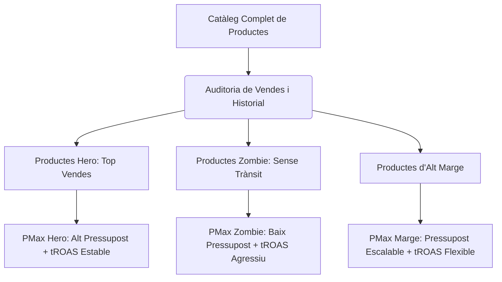

Les campanyes **Performance Max (PMax)** de Google Ads s'han consolidat com l'estàndard d'or per a molts comerços electrònics i generadors de leads gràcies a la seva capacitat d'automatitzar la puja, la segmentació i la distribució de creatius en tots els canals de Google (Cerca, Shopping, YouTube, Display, Discover i Maps) des d'una sola interfície. No obstant, el seu punt fort més gran és també el seu punt feble més gran: la dependència absoluta d'algoritmes de caixa negra (*black box*).

Qualsevol Media Buyer experimentat sap que escalar el pressupost a PMax no és un procés lineal. Pujar el pressupost diari un $50\%$ de cop sol provocar una caiguda dràstica del Retorn de la Inversió Publicitària (ROAS), un increment descontrolat del Cost per Adquisició (CPA) i la desviació del pressupost cap a inventari publicitari de baixa qualitat (com la xarxa de Display o vídeos de farciment). En aquest article tècnic, analitzarem la mecànica interna de PMax davant increments de pressupost, formularem l'impacte matemàtic del retorn marginal decreixent i proporcionarem una guia pas a pas per escalar de forma estable i controlada.

---

## La llei dels retorns marginals decreixents en la publicitat programàtica

Per entendre per què el rendiment decau en escalar, hem d'examinar la relació matemàtica entre la inversió publicitària ($S$) i els ingressos generats ($R$). Les plataformes d'anuncis funcionen sota un model de subhasta dinàmica on les audiències d'alta intenció de compra s'esgoten primer.

Podem modelar els ingressos en funció de la despesa utilitzant una funció de producció de potència amb retorns decreixents (corba de saturació publicitària):

$$R(S) = \alpha \cdot S^{\beta}$$

On:
*   $R(S)$ representa els ingressos totals generats.
*   $S$ representa l'Ad Spend o inversió publicitària.
*   $\alpha$ és un factor d'escala que mesura la conversió i el valor mitjà de comanda (AOV) base.
*   $\beta$ és l'elasticitat de la despesa publicitària, on $0 < \beta < 1$ a causa de la saturació del mercat.

El ROAS mitjà es defineix com:

$$\text{ROAS} = \frac{R(S)}{S} = \alpha \cdot S^{\beta - 1}$$

Atès que $\beta - 1 < 0$, a mesura que la inversió ($S$) augmenta, el ROAS mitjà decau de forma inexorable.

Si volem avaluar el rendiment del darrer euro invertit (ROAS Marginal o $\text{ROAS}_{\text{m}}$), hem de derivar la funció d'ingressos respecte a la despesa:

$$\text{ROAS}_{\text{m}} = \frac{dR}{dS} = \alpha \cdot \beta \cdot S^{\beta - 1} = \beta \cdot \text{ROAS}$$

Atès que $\beta < 1$, el ROAS marginal és sempre inferior al ROAS mitjà reportat a la plataforma. Quan escales el pressupost de PMax precipitadament, l'algoritme es veu obligat a fer ofertes per inventaris menys qualificats per consumir el nou pressupost assignat, cosa que accelera la caiguda de $\beta$ i enfon el ROAS marginal molt per sota del teu punt d'equilibri.

---

## El perill de la canibalització de marca (*Brand Cannibalization*)

Un dels dreceres més comuns que pren l'algoritme de PMax en rebre un augment de pressupost és la sobrepuja per termes de cerca de marca (*branded search*). En pujar pels teus propis termes de marca ("comprar sabates [Marca]"), PMax captura usuaris que ja tenien una alta intenció de compra orgànica o directa.

Això infla artificialment el ROAS al tauler de control:

$$\text{ROAS}_{\text{Fictici}} = \frac{\text{Conversions de Marca} + \text{Conversions Fredes}}{\text{Inversió en Marca} + \text{Inversió en Fred}}$$

L'algoritme barreja ambdues fonts de dades per mostrar un número agregat saludable, amagant el fet que la inversió en audiències fredes (*prospecting*) és totalment ineficient. Si el trànsit de marca representa el $80\%$ de les teves conversions PMax, l'escalat del pressupost només incrementarà la despesa en termes de marca sense aportar un volum significatiu de nous clients nets.

---

## Estratègies tècniques per escalar PMax sense perdre el ROAS

Per esquivar el col·lapse del ROAS i evitar la canibalització durant l'escalat, cal aplicar les metodologies d'optimització següents:

### 1. El mètode de l'escalat incremental controlat (Regla del 15%)
Mai incrementis el pressupost diari d'una campanya PMax en més d'un $15\% - 20\%$ d'un sol cop. Els canvis bruscos desestabilitzen l'algoritme de Smart Bidding i retornen la campanya a la fase d'aprenentatge actiu.
*   **Procediment:** Augmenta el pressupost un $15\%$, espera un període de 3 a 5 dies perquè el CPC mitjà i la taxa de conversió s'estabilitzin, verifica que el ROAS marginal es mantingui per sobre del teu objectiu i repeteix el procés.

### 2. Contenció i exclusió de marca activa
Per forçar PMax a actuar com una eina real d'adquisició de trànsit nou:
*   Aplica **llistes d'exclusió de marca** a nivell de campanya. Això impedeix que PMax pugi per variacions del teu nom comercial.
*   Crea una campanya de Cerca tradicional independent per a la teva marca amb concordança exacta i puges manuals o ROAS objectiu molt alt. D'aquesta manera, conserves el control absolut del CPA de marca i mantens PMax centrada exclusivament a capturar demanda externa.

### 3. Modificació coordinada dels objectius de puja (tROAS)
En pujar el pressupost, la tendència natural del sistema és expandir l'abast cap a audiències més barates però menys qualificades. Per contrarestar-ho, has d'ajustar la restricció del ROAS Objectiu ($\text{tROAS}$):
*   **Escalat vertical eficient:** En augmentar el pressupost un $15\%$, incrementa lleugerament l'objectiu de tROAS (per exemple, del $250\%$ al $265\%$). Això restringeix els termes de cerca admissibles per l'algoritme, forçant-lo a buscar volum addicional únicament dins dels llindars d'alta conversió en lloc de gastar en inventari Display de baixa qualitat.

### 4. Segmentació del catàleg per rendiment (Estructura de Campanyes Hero/Zombie)
Evita agrupar tot el teu catàleg de productes en una sola campanya PMax en escalar. L'algoritme tendeix a gastar la major part del pressupost en un grapat d'articles d'alta demanda i deixa la resta sense impressions.
*   **Segmentació tècnica:**
    *   **Campanyes PMax Hero:** Dedicades exclusivament als teus millors venedors històrics amb pressupostos elevats i tROAS equilibrats.
    *   **Campanyes PMax Zombie:** Agrupen productes amb poca o cap visibilitat. Es configuren amb pressupostos baixos i tROAS molt agressius per pescar conversions d'oportunitat.
    *   **Campanyes PMax d'Alt Marge:** Enfocades en productes que toleren un ROAS més baix a causa del seu alt marge brut.

### 5. Optimització del Feed de Dades sobre els Components Visuals
Si escales el pressupost i els teus creatius de vídeo o imatge al grup de recursos (*Asset Group*) són mediocres, Google desviarà el teu pressupost cap a la Xarxa de Cerca i Google Shopping perquè són els canals on el teu CTR i conversió són competitius. Si, per contra, comptes amb recursos visuals excel·lents, pots permetre que l'algoritme explori YouTube de forma rendible. Si no disposes de vídeos d'alta qualitat, sovint és preferible estructurar campanyes PMax de "només feed" (*Feed-Only*), eliminant imatges, textos i vídeos del grup de recursos. Això força PMax a comportar-se estrictament com una campanya de Smart Shopping tradicional, concentrant la inversió a la xarxa de Shopping i Cerca, que inherentment tenen una conversió superior.

## Conclusió

Escalar el pressupost a Google Performance Max exigeix una gestió meticulosa de les restriccions que imposem a l'algoritme. Sense exclusió de termes de marca, sense una estructura de catàleg segmentada i sense un ajust intel·ligent del tROAS, els diners addicionals es perdran en impressions de valor nul o en trànsit orgànic canibalitzat. Aplica augments granulars, monitora constantment la procedència del trànsit i assegura't d'avaluar el ROAS marginal real per garantir la sostenibilitat financera del teu creixement.
