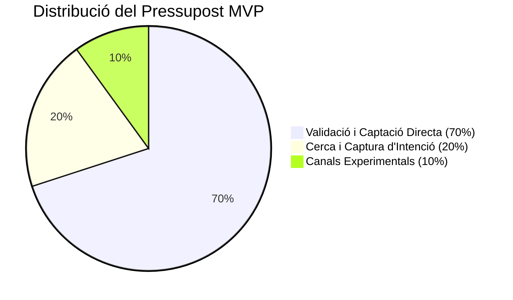

Llançar al mercat un **Producte Mínim Viable (MVP)** és una de les fases més crítiques del cicle de vida de qualsevol startup o nou projecte empresarial. El propòsit fonamental d'un MVP no és generar grans beneficis econòmics de manera immediata ni escalar l'operació a nivell massiu, sinó **aprendre**. Consisteix a validar la hipòtesi de valor del producte, avaluar la interacció real de l'usuari amb la interfície i descobrir si existeix un mercat disposat a pagar per la teva solució abans de realitzar grans inversions en desenvolupament de programari i producció.

Tanmateix, molts fundadors i directors de màrqueting cometen l'error d'aplicar pressupostos i estructures publicitàries tradicionals a un MVP. O bé injecten capital de manera massiva en campanyes de branding ineficients, o bé inverteixen pressupostos tan ridículament petits que l'algoritme publicitari no aconsegueix sortir de la fase d'aprenentatge, obtenint dades esbiaixades que porten a conclusions errònies.

En aquesta guia tècnica, analitzarem com calcular i estructurar un pressupost de Growth Marketing des de zero enfocat en la validació d'un MVP fent servir regles financeres sòlides i fórmules de significança estadística.

---

## 1. El càlcul del pressupost mínim basat en la significança estadística

El perill més gran de testar un MVP amb pressupostos escassos és el **soroll estadístic**. Si inverteixes 200 € en anuncis, aconsegueixes 2 vendes i assumes que tens un cost d'adquisició òptim, estàs prenent decisions estratègiques basades en l'atzar. Necessites acumular un volum mínim de dades per garantir que les teves taxes de conversió reflecteixen el comportament real del mercat.

Per calcular el pressupost publicitari mínim necessari per validar una hipòtesi de conversió, hem de determinar primer la **mida de mostra mínima ($N$)** requerida a la teva pàgina de destinació.

### La fórmula de la mida de mostra mínima

Una simplificació de la fórmula matemàtica per calcular el nombre de visites necessàries per validar un test amb un nivell de confiança del 95% i un marge d'error del 5% és:

$$N = \frac{1.96^2 \cdot p \cdot (1 - p)}{e^2}$$

*On:*
* $p$ és la taxa de conversió web estimada o esperada (per exemple, $0.02$ si preveem una taxa de conversió de pàgina de destinació del 2%).
* $e$ és el marge d'error admissible (per exemple, $0.02$ si volem un marge d'error del 2%).

Fem un càlcul típic: si esperem una taxa de conversió de *checkout* del **2%** ($p = 0.02$) amb un marge d'error de l'1,5% ($e = 0.015$):

$$N = \frac{3.8416 \cdot 0.02 \cdot 0.98}{0.000225} = \frac{0.075295}{0.000225} \approx 335\ \text{visites al web}$$

Per obtenir almenys 10 o 15 conversions estables que permetin analitzar el perfil dels clients, caldria dirigir aproximadament 350 - 500 usuaris qualificats al teu embut de vendes.

### Determinació del pressupost publicitari ($P_{min}$)

Un cop coneixem les visites necessàries ($N$), podem calcular el pressupost publicitari mínim requerit multiplicant aquest volum de trànsit pel **Cost per Clic (CPC)** mitjà del teu sector a les xarxes publicitàries (Meta, Google, LinkedIn):

$$P_{min} = N \cdot CPC_{mitjà}$$

Si el CPC mitjà del teu nínxol (per exemple, SaaS B2B) a LinkedIn Ads és de 3,00 €, el teu pressupost de validació mínima de l'MVP ha de ser d'almenys:

$$P_{min} = 335 \cdot 3.00\ \text{€} = 1.005\ \text{€}$$

Intentar validar aquest MVP SaaS amb un pressupost de 150 € només generarà visites insuficients que no permetran extreure cap conclusió científica sobre l'interès real del client.

---

## 2. La regla de distribució del pressupost: El marc 70 / 20 / 10

En estructurar el pressupost de Growth Marketing d'un MVP, no has de concentrar tot el capital en una sola plataforma o tàctica. Meta Ads pot saturar-se ràpidament, o Google Ads pot resultar excessivament car per a les teves paraules clau principals. Et recomanem distribuir el teu pressupost mensual seguint un marc clàssic d'assignació de riscos:

### 70% - Canal de Captació Directa Primari (Trànsit d'Impuls)
Consisteix en el canal principal on es troba el teu públic objectiu segmentat de forma visual o per interessos (generalment Meta Ads o TikTok Ads). El seu propòsit és forçar el trànsit cap a la pàgina de destinació del teu MVP per comprovar l'interès d'usuaris freds (que no coneixen la teva marca).

### 20% - Canal de Captura d'Intenció (Trànsit de Cerca)
Inversió a Google Ads (cerca pagada) dirigida específicament a paraules clau transaccionals d'alta intenció de compra. Si un usuari busca activament a Google "comprar programari de facturació MVP", has d'estar present. Aquest canal serveix per validar la conversió dels usuaris amb major probabilitat de compra del mercat.

### 10% - Canals Experimentals i Retargeting
Pressupost assignat a campanyes de *remarketing* bàsiques (per reimpacktar els usuaris que van visitar el web sense convertir en la primera sessió) o per experimentar en canals alternatius (com anuncis de nínxol o màrqueting d'afiliació local).

---

## 3. Establint els llindars de CPA Objectiu i viabilitat financera

Perquè la validació de l'MVP sigui útil, has de definir per endavant quin és el teu **Cost Per Adquisició (CPA) objectiu** o cost d'adquisició màxim viable. Si estàs validant una subscripció SaaS de 20 € al mes i el teu CPA en anuncis resulta ser de 150 €, el teu model financer requereix una reestructuració dràstica.

### La fórmula del CPA de Punt d'Equilibri (*Breakeven CPA*)

Per determinar el CPA límit que el teu negoci pot suportar abans d'entrar en pèrdues netes durant la fase de validació, aplica la relació següent:

$$CPA_{Breakeven} = \text{Valor Mitjà de la Comanda (AOV)} - COGS - \text{Costos Operatius Unitaris}$$

*   **Cas Pràctic:** Si vens un producte físic d'e-commerce a 50 € ($AOV = 50$), el teu cost de producció i importació és de 15 € ($COGS = 15$) i els costos de lliurament i passarel·les sumen 8 € ($Operatius = 8$):

$$CPA_{Breakeven} = 50\ \text{€} - 15\ \text{€} - 8\ \text{€} = 27\ \text{€}$$

Si durant la campanya de l'MVP aconsegueixes un CPA real de **22 €**, el teu producte és comercialment viable a escala. Si el teu CPA real és de **45 €**, el producte no es pot escalar de forma rendible mitjançant canals pagats amb la seva estructura actual, obligant-te a optimitzar la taxa de conversió web, renegociar el COGS o incrementar el preu de venda final del teu producte.

---

## Taula Comparativa: Estratègia de Pressupost per a MVP vs. Producte Consolidat

| Paràmetre | Fase de Validació de MVP | Producte Consolidat en Fase d'Escala |
| :--- | :--- | :--- |
| **Objectiu Principal** | Validar la hipòtesi de valor i conversió | Maximitzar el volum de vendes i ingressos nets |
| **Horitzó Temporal** | Curt termini (30 a 90 dies) | Indefinit / Escala mensual contínua |
| **Audiències** | Àmplies i genèriques (descobriment) | Segmentades, LAL i audiències de retenció |
| **Focus d'Optimització** | Taxa de conversió i retroalimentació de l'usuari | ROAS Net i marge de contribució |
| **Criteri d'Èxit** | Significança estadística i interès real | Ràtio LTV/CAC superior a 3:1 |

## Conclusió

Estructurar un pressupost de Growth Marketing per a un MVP requereix una mentalitat científica d'experimentació ràpida i control financer. En fonamentar el pressupost inicial en fórmules de mida de mostra estadística i distribuir el risc sota el model 70/20/10, t'assegures que cada euro invertit compri dades i aprenentatges reals i nets. El creuament d'aquests resultats amb el teu CPA de punt d'equilibri et donarà la resposta definitiva sobre la viabilitat comercial del teu projecte abans d'incórrer en grans despeses operatives d'escalat.
