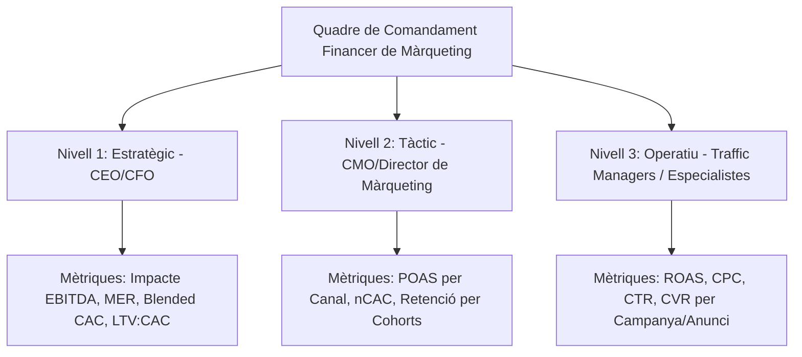

Un dels majors punts de fricció dins de les empreses en creixement és la manca de comunicació entre el departament de màrqueting digital i el departament de finances (CFO). Mentre que els especialistes en màrqueting solen celebrar l'increment del CTR, el volum de visites o un ROAS de plataforma aparentment alt, els directors financers avaluen la salut del negoci basant-se en el marge de contribució, el flux de caixa (Cash Flow) i l'impacte real en l'EBITDA.

Per tendir un pont entre aquestes dues disciplines, és fonamental dissenyar un **quadre de comandament financer de màrqueting**. Aquest tauler de control ha d'anar més enllà de les mètriques de vanitat i centrar-se en KPIs (Key Performance Indicators) que connectin la inversió publicitària amb la rendibilitat real de l'empresa.

En aquesta guia definitiva, definirem matemàticament els KPIs financers essencials per a màrqueting, n'explicarem la rellevància per a la presa de decisions i proposarem una estructura de tres nivells per organitzar el vostre tauler de control corporatiu.

---

## 1. Els KPIs Financers Clau de Màrqueting: Definicions i Fórmules

A continuació, analitzem les mètriques fonamentals que han de regir l'anàlisi financera de qualsevol estratègia d'adquisició digital.

### 1. Cost d'Adquisició de Clients (CAC)
El CAC representa el cost mitjà total incorregut per adquirir un nou client durant un període específic.

$$\text{CAC} = \frac{\text{Despeses de Màrqueting} + \text{Costos de Vendes} + \text{Despeses de Personal associades}}{\text{Nombre de Nous Clients Adquirits}}$$

És vital que el numerador no contingui només la inversió en anuncis (Ad Spend), sinó també les tarifes de les agències de màrqueting, les llicències de programari utilitzades per a captació i els salaris prorratejats dels equips comercials i de màrqueting.

### 2. Valor del Cicle de Vida del Client (LTV)
El LTV calcula el benefici net total que s'espera que un client aporti al negoci al llarg de tota la seva relació comercial.

Una fórmula bàsica per calcular el LTV és:

$$\text{LTV} = \text{Valor Mitjà de la Comanda (AOV)} \times \text{Freqüència de Compra} \times \text{Vida Mitjana del Client} \times \text{Marge Brut (\% en decimals)}$$

La relació entre LTV i CAC és el millor indicador de la viabilitat d'un model de negoci a llarg termini. La regla general de la indústria dicta que:
*   **LTV : CAC < 1,0:** El negoci perd diners amb cada client adquirit (camí a la fallida).
*   **LTV : CAC = 3,0 (3:1):** Ràtio ideal per a un creixement saludable i sostenible.
*   **LTV : CAC > 5,0:** El negoci és molt rendible, però podria estar invertint poc i perdent quota de mercat enfront de competidors més agressius.

### 3. ROAS (Return on Ad Spend)
El ROAS mesura els ingressos bruts generats per cada unitat monetària invertida en publicitat.

$$\text{ROAS} = \frac{\text{Ingressos Generats per Ads}}{\text{Inversió Publicitària (Ad Spend)}}$$

Tot i que és el KPI més comú a les plataformes publicitàries, el ROAS té una limitació severa: no té en compte el cost del producte (COGS), ni les devolucions, ni les comissions de pagament. Operar guiant-se únicament pel ROAS pot portar a la falsa creença que una campanya és rendible quan en realitat està perdent diners a causa de marges reduïts.

### 4. POAS (Profit on Ad Spend)
Per resoldre les deficiències del ROAS, els negocis amb major control analític utilitzen el POAS. Aquest KPI mesura el benefici brut real generat per la publicitat enfront de la despesa publicitària.

$$\text{POAS} = \frac{\text{Benefici Brut de Vendes per Ads}}{\text{Inversió Publicitària (Ad Spend)}}$$

On:
$$\text{Benefici Brut} = \text{Ingressos per Ads} - \text{COGS} - \text{Costos d'Enviament} - \text{Comissions de Pagament}$$

*   Un **POAS > 1,0** indica que les campanyes publicitàries estan generant un benefici net positiu després de cobrir tots els costos del producte i el seu enviament.
*   Un **POAS < 1,0** significa que la publicitat està erosionant el capital del negoci amb cada venda realitzada.

### 5. MER (Marketing Efficiency Ratio) o ROAS Combinat
El MER ofereix una vista macroscòpica de l'eficiència del màrqueting, relacionant la facturació total de la companyia amb la despesa total en publicitat.

$$\text{MER} = \frac{\text{Ingressos Totals del Negoci}}{\text{Inversió Publicitària Total}}$$

Aquesta mètrica és clau en l'era posterior a iOS 14, on l'atribució directa a les plataformes publicitàries s'ha tornat menys precisa. El MER us permet veure l'impacte real agregat de les vostres inversions de pagament sobre el total de vendes (incloent-hi canals orgànics, directes i recomanats).

### 6. nCAC (New Customer Acquisition Cost)
Distingeix el cost d'adquirir un client nou enfront de la inversió en retenir o incentivar compres recurrents en clients existents (retargeting).

$$\text{nCAC} = \frac{\text{Inversió en Ads de Captació (Prospecting)}}{\text{Total de Nous Clients Adquirits}}$$

Supervisar el nCAC de forma aïllada permet saber si la maquinària de creixement de l'empresa continua sent eficient per atreure noves audiències a l'ecosistema.

---

## 2. Estructura del Quadre de Comandament en Tres Nivells

Perquè un quadre de comandament financer de màrqueting sigui operatiu, no ha de saturar els usuaris amb dades innecessàries. S'ha d'organitzar en tres nivells de report segons el rol de la persona que el consumeixi:

### Nivell 1: Vista Estratègica (Destinat a: CEO, CFO, Inversors)
*   **Objectiu:** Avaluar la viabilitat i la salut financera del negoci a nivell corporatiu.
*   **KPIs Clau:** MER, Blended CAC, Relació LTV:CAC, Contribució del Màrqueting a l'EBITDA, Inversió total de màrqueting enfront d'ingressos totals (%).
*   **Freqüència d'anàlisi:** Mensual o Trimestral.

### Nivell 2: Vista Tàctica (Destinat a: CMO, Director de Màrqueting)
*   **Objectiu:** Optimitzar l'assignació pressupostària entre canals i productes.
*   **KPIs Clau:** POAS per canal d'adquisició, nCAC enfront de LTV de cohort, Taxa de retenció de clients en primera compra, Costos de producció de contingut enfront de rendiment orgànic.
*   **Freqüència d'anàlisi:** Setmanal o Quinzenal.

### Nivell 3: Vista Operativa (Destinat a: Traffic Managers, Especialistes en Ads/SEO)
*   **Objectiu:** Ajustar puges, creatius i copies en temps real.
*   **KPIs Clau:** ROAS nominal a plataforma (Meta/Google), Cost per Clic ($CPC$), Taxa de Conversió ($CVR$), Puntuació de qualitat (Quality Score), CTR de creatius.
*   **Freqüència d'anàlisi:** Diària o Interdiària.

---

## 3. Integració de Dades i Bones Pràctiques Tècniques

Per construir un quadre de comandament robust i automatitzat que minimitzi l'error humà, seguiu aquestes directrius metodològiques:

1.  **Connexió de Fonts Unificada:** Utilitzeu eines de Business Intelligence (com Looker Studio, PowerBI o Tableau) connectades a connectors automàtics (Supermetrics, Funnel.io) per extreure dades en temps real de Meta Ads, Google Ads, TikTok Ads i les vostres plataformes transaccionals (Shopify, WooCommerce, Stripe).
2.  **Sincronització amb ERP/CRM:** Per calcular el LTV i el benefici brut real (POAS), el quadre de comandament ha de rebre les dades de costos reals de l'ERP de l'empresa i la taxa de conversió final des del CRM.
3.  **Alineació de Monedes i Taxes:** Assegureu-vos que totes les plataformes converteixin les seves despeses a una única moneda base utilitzant la taxa de canvi del dia corresponent per evitar distorsions de marge en mercats internacionals.

## Conclusió

El disseny d'un quadre de comandament financer de màrqueting digital transforma l'anàlisi publicitària d'un centre de costos a un motor d'inversió estratègica. En passar d'avaluar les campanyes mitjançant el simple ROAS a mesurar-les amb indicadors de benefici brut i eficiència agregada com el POAS i el MER, garantireu que cada euro invertit en publicitat contribueixi directament al creixement de l'EBITDA i al benefici net consolidat de l'empresa.
