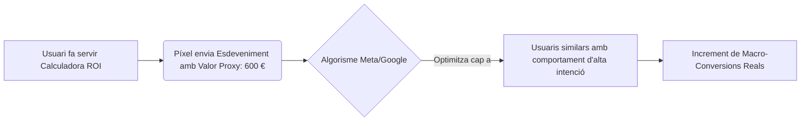

Vendre productes de compra per impuls (low-ticket e-commerce, moda ràpida, accessoris econòmics) ofereix un avantatge algorítmic innegable: el volum i la immediatesa de les dades. El recorregut del client (customer journey) dura minuts i el píxel d'anuncis (Meta Conversions API, Google Tag) rep un flux constant d'esdeveniments de compra en temps real.

Per contra, en els **productes d'alta consideració** (B2B SaaS corporatiu, serveis professionals high-ticket, venda d'immobles, formació executiva o e-commerce de luxe), el procés de presa de decisions del consumidor es dilata setmanes o mesos. El volum de macro-conversions finals (vendes confirmades o leads hiperqualificats) és reduït i el cicle de retroalimentació és lent. Com a resultat, el píxel es queda famolenc de dades, les campanyes no aconsegueixen sortir de la fase d'aprenentatge o cauen en l'estat d'\"Aprenentatge limitat\" (Learning Limited), incrementant els costos publicitaris (CPM) i destruint l'estabilitat del ROI.

En aquest article tècnic, analitzarem com estructurar i utilitzar les **micro-conversions** com a senyals proxy per alimentar els algorismes de les plataformes publicitàries, com validar matemàticament la seva correlació amb les vendes i com implementar-les eficaçment.

---

## La crisis de la fase d'aprenentatge en cicles de venda llargs

Els motors de licitació intel·ligents de Meta Ads i Google Ads es basen en l'aprenentatge automàtic (Machine Learning). Per optimitzar eficaçment un conjunt d'anuncis, l'algorisme necessita identificar patrons comuns entre els usuaris que converteixen.
*   **La regla empírica de Meta:** Es requereixen aproximadament **50 conversions per conjunt d'anuncis a la setmana** perquè l'algorisme surti de la fase d'aprenentatge i comenci a estabilitzar el cost per resultat.
*   **La conseqüència del baix volum:** Si el teu producte és un programari B2B de $5.000\ \text{€}$ a l'any i el teu pressupost et permet generar $5$ demostracions (macro-conversions) setmanals, l'algorisme operarà permanentment sota una alta volatilitat. Estarà donant "pals de cec" perquè la mostra estadística és insuficient per predir quins perfils d'audiència tenen major propensió a la conversió.

Per solucionar això, hem de desplaçar l'objectiu d'optimització de la campanya cap amunt en l'embut (funnel), seleccionant un esdeveniment intermedi o **micro-conversió** que registri la suficient massa crítica de dades, però que mantingui una estreta correlació d'intenció amb la venda final.

---

## Mapeig de Micro-conversions per Sector

Una micro-conversió no ha de ser simplement una visita a la pàgina d'inici. Ha de representar una fita d'alta intenció i esforç cognitiu per part de l'usuari.

| Vertical | Macro-conversió (Objectiu Final) | Micro-conversions Recomanades (Senyals de Píxel) |
| :--- | :--- | :--- |
| **B2B SaaS / Serveis** | Demo agendada o signatura de contracte. | * Ús de la calculadora de ROI al web. * Descàrrega de whitepapers tècnics. * Visualització del $75\%$ del vídeo de demo comercial. * Permanència a la pàgina de preus > 90 segons. |
| **E-commerce High-Ticket** | Compra d'article (ex. sofàs de $2.000\ \text{€}$). | * Ús del configurador 3D de materials. * Clic al botó \"Veure finançament\". * Afegir a la cistella (ATC) / Iniciar Pagament (IC). * Lectura completa de la secció d'opinions o FAQs. |
| **Infoproductes High-Ticket** | Compra de mentoria ($3.000\ \text{€}$). | * Registre en webinar gratuït. * Obertura del formulari d'aplicació. * Resposta completa a un test/quiz de diagnòstic. |

---

## Validació Matemàtica de Micro-conversions: L'Anàlisi de Correlació

Optimitzar les teves campanyes cap a una micro-conversió que no té una relació causal directa amb les vendes és un error catastròfic. Podries aconseguir milers de descàrregues d'un PDF gratuït (micro-conversió) realitzades per usuaris recol·lectors d'informació que mai no compraran el teu servei premium (macro-conversió).

Per validar tècnicament una micro-conversió, hem de calcular la **Probabilitat de Transició Condicional** o Taxa de Conversió de Micro a Macro ($P(\text{Macro} \mid \text{Micro})$):

$$P(\text{Macro} \mid \text{Micro}) = \frac{P(\text{Macro} \cap \text{Micro})}{P(\text{Micro})} = \frac{\text{Número total de Macro-conversions}}{\text{Número total de Micro-conversions}}$$

### Cas d'Estudi Numèric:
Un B2B SaaS que ven programari de facturació audita les dades del seu embut durant un trimestre:
*   **Usuaris que completen el registre a un Webinar:** $1.200$
*   **Usuaris que utilitzen la Calculadora de ROI al web:** $400$
*   **Vendes finals assolides (Macro):** $24$

Calculem la probabilitat condicional per a cada micro-conversió:

#### 1. Webinar:
$$P(\text{Venda} \mid \text{Webinar}) = \frac{24\ \text{vendes procedents de webinar}}{1.200\ \text{registres}} = 0,02\ (2\%)$$

#### 2. Calculadora de ROI:
$$P(\text{Venda} \mid \text{Calculadora}) = \frac{24\ \text{vendes procedents de calculadora}}{400\ \text{usos}} = 0,06\ (6\%)$$

Encara que el Webinar aporta major volum brut, l'ús de la **Calculadora de ROI** demostra una intenció de compra tres vegades superior ($6\%$ vs $2\%$). Si el volum de la calculadora ($400$ esdeveniments al mes, aprox. $93$ per setmana) supera folgadament el llindar dels $50$ esdeveniments setmanals exigits per les plataformes, la calculadora de ROI és el senyal de micro-conversió òptima per entrenar el píxel.

---

## Implementació de Micro-conversions en Estratègies de Licitació

Una vegada identificada la micro-conversió idònia, la implementació operativa segueix aquests passos:

### A. Assignació de Valors Financers Proxy (Value-Based Optimization)
Perquè l'algorisme aprengui a buscar usuaris de valor, no tractis tots els esdeveniments per igual. Assigna un valor monetari proxy a les micro-conversions en base a la seva probabilitat de tancament i el Customer Lifetime Value (LTV) o el preu del producte:

$$\text{Valor Proxy de Micro} = \text{Valor Macro} \times P(\text{Macro} \mid \text{Micro})$$

Si el teu contracte mitjà corporatiu val $10.000\ \text{€}$ i la probabilitat condicional que un lead que fa servir la calculadora acabi comprant és del $6\%$:

$$\text{Valor Proxy} = 10.000\ \text{€} \times 0,06 = 600\ \text{€}$$

Configura aquest valor proxy de $600\ \text{€}$ a Meta Conversions API o Google Tag Manager per a l'esdeveniment personalitzat `Calculadora_ROI_Completada`. Això permet activar licitacions basades en valor (Value-Based Bidding / ROAS Objectiu) en lloc de licitacions basades únicament en volum (CPA Objectiu).

### B. L'Estratègia de l'Embut de "Fallback" (Fallback Campaign)
Quan llancis un nou compte o producte al mercat:
1.  **Fase 1 (Arrencada):** Configura l'optimització de la campanya apuntant directament a l'esdeveniment de micro-conversió d'alta intenció (ej. `Afegir a la cistella` en e-commerce d'alta gamma, o `Descarregar Demo` en SaaS). Això acumula dades ràpidament i permet a l'algorisme sortir de la fase d'aprenentatge en menys d'una setmana.
2.  **Fase 2 (Maduració):** Una vegada que la campanya de micro-conversió genera de forma indirecta un flux constant i previsible de macro-conversions (més de 30-40 vendes setmanals a nivell de compte), duplica la campanya i canvia l'objectiu d'optimització a la macro-conversió final (`Compra` o `Demo completada`). El píxel ja haurà recopilat suficients dades històriques d'atribució per identificar el perfil ideal del comprador net.

## Conclusió

L'èxit de la compra de mitjans en mercats complexos no depèn de la intuïció creativa, sinó de la qualitat de les dades que entregues a l'algorisme. No intentis optimitzar les teves campanyes per a la compra final de productes d'alta consideració si no comptes amb el volum estadístic necessari per alimentar la fase d'aprenentatge. Mesura la probabilitat condicional dels teus esdeveniments intermedis, defineix micro-conversions d'alta intenció, assigna'ls valors econòmics basats en la seva correlació real i utilitza-les com el combustible necessari per estabilitzar i escalar el teu ROI publicitari.
