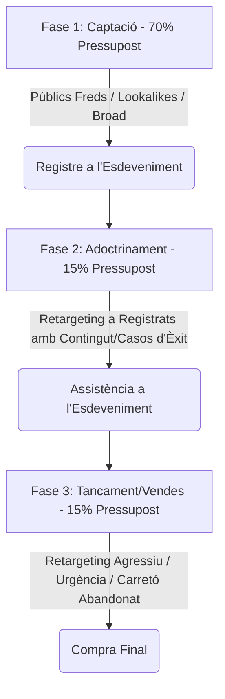

El sector dels infoproductes (cursos en línia, membresies, programes de mentoria i coaching high-ticket) compta amb una de les estructures de costos mésives de l'ecosistema digital, caracteritzada per costos marginals de producció propers a zero i marges bruts excepcionalment alts. No obstant això, aquesta alta rentabilitat potencial atrau una competència ferotge a les plataformes de compra de trànsit, elevant els costos per clic (CPC) i per lead.

En aquest entorn, l'èxit financer d'un llançament o d'un embut (*funnel*) evergreen (sempre verd) no depèn de l'atzar, sinó de l'arquitectura de l'embut de conversió i de com estructures les teves campanyes a Meta Ads (Facebook i Instagram). A diferència de l'ecommerce tradicional, on la compra sol ser immediata, los infoproductes exigeixen un procés educatiu i de generació de confiança previ. En aquest article tècnic, analitzarem els principals models d'embuts per a infoproductes, modelarem matemàticament el càlcul del ROAS en llançaments i detallarem les estructures de campanya òptimes a Meta Ads.

---

## Tipus d'Embuts per a Infoproductes i la seva Dinàmica Financera

Depenent del preu de l'infoproducte (Price Point), l'estructura de l'embut canvia dràsticament per adaptar-se a l'esforç cognitiu i econòmic que ha de fer el comprador:

### 1. L'Embut d'Entrada Directa (Low-Ticket / Tripwire)
*   **Rang de Preu:** 7 € - 49 €.
*   **Estratègia:** Venda directa mitjançant trànsit fred. L'objectiu principal no és generar un gran benefici immediat, sinó adquirir un client al menor cost possible per amortitzar el CAC. La rentabilitat real s'obté en el segon pas de l'embut (Order Bumps i Upsells immediats) o mitjançant la venda posterior de productes de valor superior.

### 2. L'Embut de Webinar / VSL (Mid-Ticket)
*   **Rang de Preu:** 97 € - 997 €.
*   **Estratègia:** Els usuaris es registren per a un esdeveniment en línia gratuït (classe en directe, taller o vídeo de vendes interactiu - VSL). Durant la sessió de 60-90 minuts, s'aporta valor tècnic, es resolen objeccions i es presenta l'oferta de pagament amb un límit de temps (escassetat).

### 3. L'Embut d'Aplicació / Trucada (High-Ticket)
*   **Rang de Preu:** > 1.000 €.
*   **Estratègia:** A aquest nivell, els usuaris no compren de manera autònoma amb targeta de crèdit en una pàgina de checkout. El flux publicitari s'orienta a que el prospecte qualificat completi un formulari d'aplicació i reservi una sessió de diagnòstic telefònic amb un equipo d'assessors de vendes (Closers).

---

## Modelat Matemàtic de Rentabilitat en Llançaments (Equació del ROAS de Webinar)

Per als infoproductes venuts mitjançant seminaris web (webinars) o reptes de diversos dies, la rentabilitat final està estretament lligada a la eficiència del trànsit fred i a les taxes d'assistència.

Definim les variables del sistema:
*   $S$: Inversió publicitaria total (Ad Spend).
*   $CPR$: Cost per Registre (Cost Per Registration o cost per lead).
*   $N_{\text{reg}}$: Nombre d'usuaris registrats per a l'esdeveniment ($N_{\text{reg}} = S / CPR$).
*   $CR_{\text{show}}$: Taxa d'assistència a l'esdeveniment (Show-up rate). Per exemple, si es registren 1.000 persones i hi assisteixen en directe 300, la taxa és de $0,30\ (30\%)$.
*   $CR_{\text{sales}}$: Taxa de conversió d'assistents a compradors.
*   $P$: Preu de venda de l'infoproducte.

Els ingressos totals generats ($R$) es calculen com:

$$R = N_{\text{reg}} \times CR_{\text{show}} \times CR_{\text{sales}} \times P$$

Sustituint $N_{\text{reg}}$ en funció de la inversió i el cost per lead:

$$R = \frac{S}{CPR} \times CR_{\text{show}} \times CR_{\text{sales}} \times P$$

El ROAS de la campanya es defineix com:

$$\text{ROAS} = \frac{R}{S} = \frac{\frac{S}{CPR} \times CR_{\text{show}} \times CR_{\text{sales}} \times P}{S}$$

Simplificant la despesa publicitària ($S$), obtenim la **Equació Fonamental del ROAS per a Llançaments**:

$$\text{ROAS} = \frac{CR_{\text{show}} \times CR_{\text{sales}} \times P}{CPR}$$

> [!IMPORTANT]
> El ROAS d'un embut de webinar és totalment independent del pressupost total invertit ($S$), sempre que les taxes de conversió i el cost per registre es mantinguin estables. L'èxit depèn d'equilibrar el cost d'adquisició de registres ($CPR$) amb la qualitat i capacitat de persuasió de l'esdeveniment ($CR_{\text{show}} \times CR_{\text{sales}}$).

### Simulació Pràctica:
*   **Preu del Curs ($P$):** 497 €
*   **Cost per Registre ($CPR$):** 3,50 €
*   **Taxa d'Assistència ($CR_{\text{show}}$):** $35\%\ (0,35)$
*   **Taxa de Tancament ($CR_{\text{sales}}$):** $4\%\ (0,04)$

Calculem el ROAS esperat:
$$\text{ROAS} = \frac{0,35 \times 0,04 \times 497\ \text{€}}{3,50\ \text{€}} = \frac{0,014 \times 497}{3,50} = \frac{6,958}{3,50} = 1,988\ (\approx 2,0)$$

Per cada euro invertit en captació a Meta Ads, l'infoproductor recupera 2,00 €. Si el $CPR$ puja a 5,00 € a causa de la saturació del mercat, el ROAS caurà immediatament a:
$$\text{ROAS} = \frac{6,958}{5,00} = 1,39$$

---

## Estructura de Campanyes a Meta Ads per a Llançaments

Per a un llançament estructurat en el temps (com la clàssica fórmula de llançament en 4 fases), l'arquitectura de Meta Ads s'ha de segmentar per fases operatives clares:

### Fase 1: Captació (Lead Gen)
*   **Objectiu d'Optimització:** Conversió (`Client potencial` / `Lead`).
*   **Segmentació:** Públics amplis (Broad targeting sense segmentació d'interessos, confiant en les creativitats), Lookalikes de compradors històrics i una selecció d'interessos nínxol d'alta rellevància.
*   **Pressupost:** Representa entre el **70% i el 80% del pressupost total** de la campanya. La seva única missió és omplir la llista de correu del llançament amb el menor CPR possible.

### Fase 2: Adoctrinament i Consum (Nurturing)
*   **Objectiu d'Optimització:** Conversions de micro-interaccions o Abast / Reproduccions de vídeo.
*   **Segmentació:** Exclusivament retargeting personalitzat dels usuaris registrats a la Fase 1.
*   **Estratègia creativa:** Mostrar testimonis d'alumnes, casos d'èxit reals i vídeos curts que reforcin l'autoritat del mentor o expliquin els pilars conceptuals del mètode que s'ensenyarà al webinar. L'objectiu aquí és elevar el $CR_{\text{show}}$ (taxa d'assistència).

### Fase 3: Vendes i Tancament (Cart Open)
*   **Objectiu d'Optimització:** Compra (`Purchase`) o inici de pagament al web.
*   **Segmentació:** Retargeting de tots els registrats que van assistir a l'esdeveniment, usuaris que van visitar la pàgina de vendes del curs i excloent els que ja han comprat.
*   **Estratègia creativa:** Anuncis orientats al dolor, objeccions comunes (preu, temps, suport), bonificacions addicionals de darrera hora i compte enrere interactiu per generar urgència (\"El carretó tanca en 12 hores\").

---

## Regles d'Or per a la Distribució del Pressupost

En llançaments de format curt (10 a 14 dies totals amb carretó obert durant 5 dies), la distribució recomanada del pressupost publicitat segueix una pauta estricta:

1.  **Dies 1 a 8 (Fase de Captació):** 100% de la inversió diària es dedica a captar registres (Fase 1).
2.  **Dies 9 a 11 (Fase de Calentament i Esdeveniment):** 80% a captació de ressagats i 20% a campanyes de retargeting d'adoctrinament per assegurar l'assistència al webinar.
3.  **Dies 12 a 15 (Obertura de Carretó):** S'atura la captació de leads. El pressupost diari es redistribueix: 70% a retargeting de vendes calent (pàgina de vendes i carretó abandonat) and 30% a audiències tibantades (registrats al webinar que encara no han visitat la pàgina de pagament).

## Conclusió

La publicitat a Meta Ads per a infoproductes exigeix una mentalitat centrada en les mètriques de l'embut complet, no només en les de la plataforma publicitària. Un Cost per Registre baix no serveix de res si la teva taxa d'assistència és baixa o si l'equip de vendes no té la capacitat de tancar els leads programats. En modelar les teves campanyes estructurant el pressupost de forma dinàmica per fases de llançament i optimitzant les conversions basant-te en l'equació del ROAS objectiu, garanteixes un creixement previsible i altament rentable per al teu negoci de formació o consultoria.
