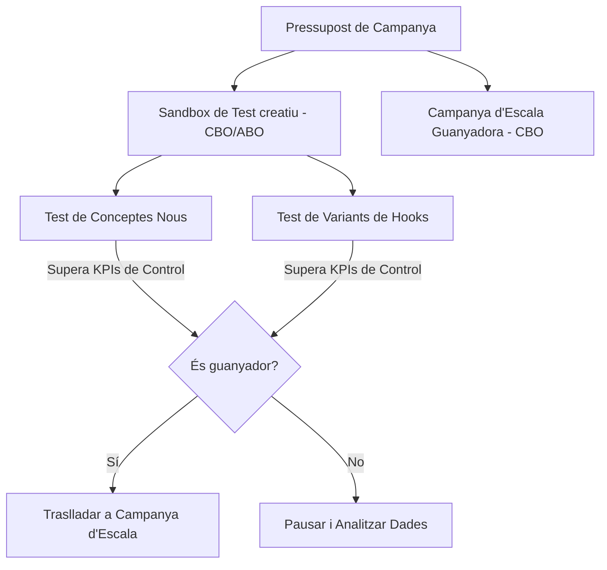

L'auge de TikTok com a canal d'adquisició publicitària per al comerç electrònic ha redefinit les regles del joc del màrqueting de resultats. Amb el seu format natiu de vídeo a pantalla completa i vertical i un algorisme de recomanació hiperoptimitzat, la plataforma ofereix a les marques directes al consumidor (D2C) una oportunitat única per viralitzar productes i capturar vendes amb un cost d'entrada competitiu.

Tanmateix, fer publicitat a TikTok Ads comporta un repte operatiu dràstic que les marques acostumades a Meta Ads (Facebook i Instagram) solen subestimar: **el cicle de vida de l'anunci és extremadament curt**. A causa de la naturalesa de consum ràpid de contingut de la plataforma, un anunci creatiu que reporta un ROAS extraordinari avui pot saturar el públic objectiu i deixar de ser rentable en tot just 7 a 14 dies. Aquest fenomen es coneix tècnicament com a **fatiga del creatiu accelerada**.

En aquesta guia tècnica, analitzarem per què es produeix aquesta saturació, quines mètriques avançades has de monitorar per anticipar la caiguda del rendiment i com estructurar el teu compte de TikTok Ads per provar i escalar vídeos de forma automatitzada i sostenible.

---

## La anatomia de la fatiga creativa a TikTok

A Facebook Ads, una imatge estàtica o un vídeo ben produït pot funcionar de manera rentable durant mesos si el públic és prou ampli. A TikTok, els usuaris acudeixen a la plataforma a entretenir-se i consumeixen desenes de vídeos per minut. El seu cervell aprèn a identificar i ometre els anuncis publicitaris tradicionals a l'instant.

Quan la freqüència d'exposició del teu anunci puja en un públic objectivo determinat, es produeixen tres efectes financers negatius correlacionats:

1. **Caiguda del Hook Rate (Taxa d'Enganxament):** Els usuaris llisquen cap amunt (swipe) el teu vídeo en els primers 2 segons de reproducció.
2. **Augment del CPM (Cost per Mil Impressions):** En detectar que el teu contingut avorreix o genera rebuig físic (baixa taxa de retenció), l'algorisme de subhasta de TikTok et penalitza encarint el cost de visualització.
3. **Disminució del ROAS Net:** El Cost per Adquisició (CPA) s'incrementa de forma exponencial, erosionant el marge net publicitari de la botiga en línia.

---

## Dues mètriques tècniques per predir la saturació

Per no prendre decisions tardanes basades únicament en la caiguda final del ROAS mensual, has d'auditar setmanalment la salut creativa dels teus anuncis mitjançant dues mètriques clau de retenció de vídeo:

### 1. Hook Rate (Taxa de Ganxo / Retenció a 2s)
Mesura la capacitat dels primers dos segons del teu vídeo per capturar l'atenció visual de l'usuari i frenar el desplaçament continu (scroll).

$$Hook\ Rate = \frac{\text{Reproduccions de Vídeo de 2 segons}}{\text{Impressions Totals}} \times 100$$

*   **Benchmark:** Un Hook Rate per sota del **25%** indica que el ganxo inicial de l'anunci ha deixat de ser atractiu o està saturat. Un Hook Rate saludable hauria de rondar el **35% - 50%**.

### 2. Hold Rate (Taxa de Retenció a 6s)
Avalua el percentatge de persones que romanen interessades en el vídeo després de superar el ganxo inicial, consumint el nucli del missatge publicitari.

$$Hold\ Rate = \frac{\text{Reproduccions de Vídeo de 6 segons}}{\text{Impressions Totals}} \times 100$$

*   **Benchmark:** El teu Hold Rate ha de superar almenys el **10% - 15%**. Si el teu Hook Rate és alt però el teu Hold Rate cau en picat, significa que la teva introducció va ser atractiva (potser un ganxo clickbait) però el cos del vídeo no va aconseguir sostenir la promesa inicial ni connectar amb el dolor del client.

---

## L'estructura de compte recomanada: Sandbox de Test + Campanya d'Escala

Per mantenir un ROAS pla i previsible al llarg del temps, has de separar per complet la fase d'experimentació creativa de la fase d'escala de vendes. Això evita que la inserció de nous vídeos inestables desoptimitzi les campanyes madures que ja operen amb eficiència.

### 1. El Sandbox de Test Creatiu (Ad Group Budget Optimization - ABO)
L'objectiu d'aquesta campanya secundària és enfrontar nous conceptes i variacions creatives entre si sota pressupostos controlats de manera ràpida.
*   **Segmentació:** Utilitza audiències àmplies (Broad Targeting) sense segmentació per interessos ni dades demogràfiques restrictives. Deixa que el propi contingut del vídeo actuï com a filtre natural de segmentació.
*   **Estructura de l'Ad Group:** Col·loca entre 3 i 5 variacions de vídeo dins de cada grup d'anuncis.
*   **Regla d'Or del Test:** Modifica una única variable per grup d'anuncis. Per exemple, mantén el mateix cos de vídeo i el mateix checkout, però experimenta amb 3 variacions diferents dels ganxos inicials (els primers 2-3 segons).

### 2. La Campanya d'Escala (Campaign Budget Optimization - CBO)
Aquí resideix el pressupost principal d'adquisició publicitària del compte.
*   **Regles d'Inserció:** Només s'introdueixen els vídeos que hagin superat els KPIs mínims de control (Hook Rate > 35%, CPA per sota de l'objectiu històric) dins del Sandbox de Test.
*   **Formats Combinats:** Utilitza tant anuncis estàndard (anuncis pagats normals dirigits a la landing page) com **Spark Ads** (anuncis construïts utilitzant publicacions orgàniques del compte de la marca o de perfils de creadors/influencers mitjançant codis d'autorització). Els Spark Ads tendeixen a reportar taxes d'interacció i conversió superiors en integrar-se de forma més fluida en el feed orgànic.

---

 Taula Comparativa: Formats d'Anuncis a TikTok

| Paràmetre Operatiu | Spark Ads (Vídeos Orgànics / Creadors) | Non-Spark Ads (Anuncios Tradicionals) |
| :--- | :--- | :--- |
| **Origen de l'Anunci** | Post real en perfil orgànic de marca/influencer | Arxiu pujat exclusivament a l'Ad Manager |
| **Destí del Clic al Perfil** | Dirigeix directament al canal del creador o perfil | No hi ha perfil orgànic, no es pot fer clic a la foto |
| **Retenció del Trànsit** | Construeix comunitat orgànica a TikTok a llarg termini | Purament transaccional cap a la Landing Page |
| **Hook Rate Mitjà** | Alt (s'integra millor en el feed orgànic de l'usuari) | Mitjà-Baix (té aparença explícita d'anunci) |
| **CPA Relatiu** | Generalment un 15% - 25% més econòmic | Estàndard de la subasta publicitària |

---

## Estratègies avançades per allargar la vida útil dels teus vídeos

Per no col·lapsar operativament intentant produir 10 vídeos originals per setmana, pots aplicar les següents optimitzacions de muntatge per esprémer al màxim la teva biblioteca multimèdia:

1. **Reescriure i intercanviar Hooks:** El 80% del rendiment d'un vídeo a TikTok es decideix en els primers 3 segons. Si tens un vídeo guanyador que comença a decaure, grava 3 noves introduccions diferents (canviant el gancho de text, usant un unboxing dinàmic o una pregunta provocativa) i combina-les amb el cos de vídeo existent que ja va convertir en el passat.
2. **Utilitzar veus en off dinàmiques (Text-to-Speech):** Utilitza les veus integrades d'IA de TikTok o de plataformes professionals per canviar el missatge d'àudio i provar diferents arguments de venda (per exemple, dolor emocional enfront de dolor financer) sense necessitat de tornar a filmar l'actor.
3. **Optimitzar la música en tendència:** El ritme de la música dicta el patró d'atenció de l'usuari a la plataforma. Canviar la pista de fons del teu anunci per la cançó en tendència de la setmana pot reactivar la interacció i reduir temporalment el CPM a la subhasta.

## Conclusió

El comerç electrònic a TikTok Ads no és un joc de segmentacions avançades ni de licitacions de precisió; és un joc de **resistència i velocitat creativa**. Estructurar el teu compte publicitari separant la fase d'experimentació (Sandbox) de la de facturació estable (Campanya d'Escala), mentre monitoritzes rigorosament les mètriques predictives de Hook Rate i Hold Rate, és l'única estratègia tècnica viable per dominar l'algorisme, mitigar la fatiga creativa i sostenir un ROAS net saludable a llarg termini.
