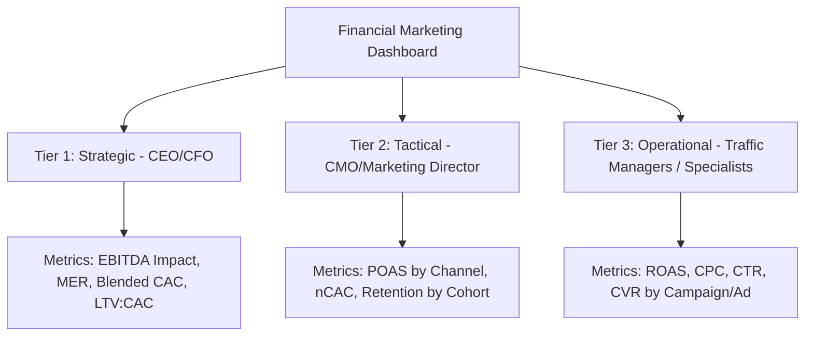

One of the greatest friction points within growing companies is the lack of communication between the digital marketing department and the finance department (CFO). While marketing specialists tend to celebrate increases in CTR, traffic volume, or an apparently high platform ROAS, financial directors evaluate business health based on contribution margin, cash flow, and real EBITDA impact.

To bridge these two disciplines, it is essential to design a **financial marketing dashboard**. This control panel must go beyond vanity metrics and focus on KPIs (Key Performance Indicators) that connect advertising investment with the company's real profitability.

In this definitive guide, we will mathematically define the essential financial KPIs for marketing, explain their relevance to decision-making, and propose a three-tier structure to organize your corporate control panel.

---

## 1. Key Financial Marketing KPIs: Definitions and Formulas

Below, we analyze the fundamental metrics that should govern the financial analysis of any digital acquisition strategy.

### 1. Customer Acquisition Cost (CAC)
CAC represents the total average cost incurred to acquire a new customer during a specific period.

$$\text{CAC} = \frac{\text{Marketing Expenses} + \text{Sales Costs} + \text{Associated Personnel Expenses}}{\text{Number of New Customers Acquired}}$$

It is vital that the numerator contains not just the ad spend, but also marketing agency fees, software licenses used for acquisition, and the prorated salaries of the commercial and marketing teams.

### 2. Customer Lifetime Value (LTV)
LTV calculates the total net profit that a customer is expected to bring to the business over the entire course of their commercial relationship.

A basic formula to calculate LTV is:

$$\text{LTV} = \text{Average Order Value (AOV)} \times \text{Purchase Frequency} \times \text{Average Customer Lifespan} \times \text{Gross Margin (\% in decimals)}$$

The relationship between LTV and CAC is the best indicator of a business model's long-term viability. The general industry rule states that:
*   **LTV : CAC < 1.0:** The business loses money on every customer acquired (on the path to bankruptcy).
*   **LTV : CAC = 3.0 (3:1):** Ideal ratio for healthy and sustainable growth.
*   **LTV : CAC > 5.0:** The business is very profitable, but may be underinvesting and losing market share to more aggressive competitors.

### 3. ROAS (Return on Ad Spend)
ROAS measures the gross revenue generated per monetary unit invested in advertising.

$$\text{ROAS} = \frac{\text{Revenue Generated by Ads}}{\text{Ad Spend}}$$

Although it is the most common KPI on advertising platforms, ROAS has a severe limitation: it does not take into account the cost of the product (COGS), returns, or payment commissions. Operating guided solely by ROAS can lead to the false belief that a campaign is profitable when it is actually losing money due to reduced margins.

### 4. POAS (Profit on Ad Spend)
To resolve ROAS's deficiencies, businesses with greater analytical control use POAS. This KPI measures the actual gross profit generated by advertising versus ad spend.

$$\text{POAS} = \frac{\text{Gross Sales Profit from Ads}}{\text{Ad Spend}}$$

Where:
$$\text{Gross Profit} = \text{Revenue from Ads} - \text{COGS} - \text{Shipping Costs} - \text{Payment Commissions}$$

*   A **POAS > 1.0** indicates that advertising campaigns are generating a positive net profit after covering all product and shipping costs.
*   A **POAS < 1.0** means that advertising is eroding the business's capital with every sale made.

### 5. MER (Marketing Efficiency Ratio) or Blended ROAS
MER offers a macroscopic view of marketing efficiency, relating total company revenue to total advertising spend.

$$\text{MER} = \frac{\text{Total Business Revenue}}{\text{Total Ad Spend}}$$

This metric is key in the post-iOS 14 era, where direct attribution on advertising platforms has become less precise. MER lets you see the real, aggregated impact of your paid investments on total sales (including organic, direct, and referred channels).

### 6. nCAC (New Customer Acquisition Cost)
Distinguishes the cost of acquiring a new customer versus the investment in retaining or incentivizing repeat purchases from existing customers (retargeting).

$$\text{nCAC} = \frac{\text{Investment in Prospecting Ads}}{\text{Total New Customers Acquired}}$$

Monitoring nCAC in isolation allows you to know whether the company's growth machinery continues to be efficient at attracting new audiences into the ecosystem.

---

## 2. Three-Tier Dashboard Structure

For a financial marketing dashboard to be operational, it must not overwhelm users with unnecessary data. It must be organized into three reporting tiers based on the role of the person consuming it:

### Tier 1: Strategic View (For: CEO, CFO, Investors)
*   **Goal:** Evaluate the viability and financial health of the business at the corporate level.
*   **Key KPIs:** MER, Blended CAC, LTV:CAC ratio, Marketing Contribution to EBITDA, Total marketing investment vs. total revenue (%).
*   **Analysis frequency:** Monthly or Quarterly.

### Tier 2: Tactical View (For: CMO, Marketing Director)
*   **Goal:** Optimize budget allocation across channels and products.
*   **Key KPIs:** POAS by acquisition channel, nCAC vs. cohort LTV, Customer retention rate on first purchase, Content production costs vs. organic performance.
*   **Analysis frequency:** Weekly or Biweekly.

### Tier 3: Operational View (For: Traffic Managers, Ads/SEO Specialists)
*   **Goal:** Adjust bids, creatives, and copy in real time.
*   **Key KPIs:** Nominal ROAS on platform (Meta/Google), Cost Per Click ($CPC$), Conversion Rate ($CVR$), Quality Score, Creative CTR.
*   **Analysis frequency:** Daily or Every Other Day.

---

## 3. Data Integration and Technical Best Practices

To build a robust and automated dashboard that minimizes human error, follow these methodological guidelines:

1.  **Unified Source Connection:** Use Business Intelligence tools (such as Looker Studio, PowerBI, or Tableau) connected to automatic connectors (Supermetrics, Funnel.io) to extract real-time data from Meta Ads, Google Ads, TikTok Ads, and your transactional platforms (Shopify, WooCommerce, Stripe).
2.  **ERP/CRM Synchronization:** To calculate real LTV and gross profit (POAS), the dashboard must receive actual cost data from the company's ERP and the final conversion rate from the CRM.
3.  **Currency and Rate Alignment:** Ensure that all platforms convert their expenses to a single base currency using the corresponding day's exchange rate to avoid margin distortions in international markets.

## Conclusion

The design of a digital marketing financial dashboard transforms advertising analysis from a cost center into a strategic investment engine. By moving from evaluating campaigns using simple ROAS to measuring them with gross profit indicators and aggregated efficiency metrics like POAS and MER, you will ensure that every euro invested in advertising contributes directly to EBITDA growth and the company's consolidated net profit.
