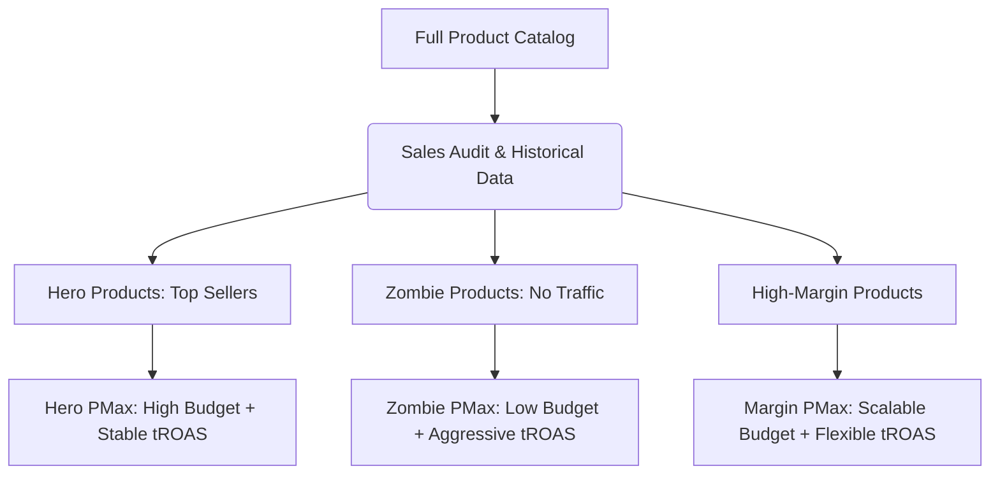

**Performance Max (PMax)** campaigns in Google Ads have become the gold standard for many e-commerce stores and lead generators, thanks to their ability to automate bidding, targeting, and creative distribution across all Google channels (Search, Shopping, YouTube, Display, Discover, and Maps) from a single interface. However, their greatest strength is also their greatest weakness: absolute dependence on black-box algorithms.

Any experienced Media Buyer knows that scaling PMax budgets is not a linear process. Suddenly increasing the daily budget by $50\%$ typically causes a dramatic drop in Return on Ad Spend (ROAS), uncontrolled increases in Cost Per Acquisition (CPA), and budget being funnelled toward low-quality ad inventory (such as the Display Network or filler videos). In this technical article, we will analyze the internal mechanics of PMax when budgets are increased, formulate the mathematical impact of diminishing marginal returns, and provide a step-by-step guide to scaling stably and in a controlled manner.

---

## The Law of Diminishing Marginal Returns in Programmatic Advertising

To understand why performance decays when scaling, we must examine the mathematical relationship between ad spend ($S$) and generated revenue ($R$). Ad platforms operate under a dynamic auction model where high-purchase-intent audiences are exhausted first.

We can model revenue as a function of spend using a power production function with diminishing returns (advertising saturation curve):

$$R(S) = \alpha \cdot S^{\beta}$$

Where:
*   $R(S)$ represents total revenue generated.
*   $S$ represents Ad Spend.
*   $\alpha$ is a scale factor measuring conversion and the base Average Order Value (AOV).
*   $\beta$ is the elasticity of ad spend, where $0 < \beta < 1$ due to market saturation.

Average ROAS is defined as:

$$\text{ROAS} = \frac{R(S)}{S} = \alpha \cdot S^{\beta - 1}$$

Since $\beta - 1 < 0$, as investment ($S$) increases, average ROAS inexorably decays.

If we want to evaluate the performance of the last euro invested (Marginal ROAS or $\text{ROAS}_{\text{m}}$), we must derive the revenue function with respect to spend:

$$\text{ROAS}_{\text{m}} = \frac{dR}{dS} = \alpha \cdot \beta \cdot S^{\beta - 1} = \beta \cdot \text{ROAS}$$

Since $\beta < 1$, the marginal ROAS is always lower than the average ROAS reported on the platform. When you scale PMax budgets hastily, the algorithm is forced to bid on less qualified inventory to consume the newly allocated budget, which accelerates the decline of $\beta$ and drives the marginal ROAS well below your break-even point.

---

## The Danger of Brand Cannibalization

One of the most common shortcuts the PMax algorithm takes when receiving a budget increase is overbidding on branded search terms. By bidding on your own brand terms (e.g., "buy shoes [Brand]"), PMax captures users who already had high organic or direct purchase intent.

This artificially inflates ROAS in the dashboard:

$$\text{ROAS}_{\text{Fictitious}} = \frac{\text{Brand Conversions} + \text{Cold Conversions}}{\text{Brand Spend} + \text{Cold Spend}}$$

The algorithm mixes both data sources to display a healthy aggregate number, hiding the fact that spend on cold audiences (prospecting) is completely inefficient. If brand traffic represents $80\%$ of your PMax conversions, scaling the budget will only increase spend on brand terms without delivering a significant volume of net new customers.

---

## Technical Strategies to Scale PMax Without Losing ROAS

To avoid ROAS collapse and prevent cannibalization during scaling, the following optimization methodologies must be applied:

### 1. The Controlled Incremental Scaling Method (The 15% Rule)
Never increase the daily budget of a PMax campaign by more than $15\% - 20\%$ at once. Sudden changes destabilize the Smart Bidding algorithm and return the campaign to the active learning phase.
*   **Procedure:** Increase the budget by $15\%$, wait 3 to 5 days for the average CPC and conversion rate to stabilize, verify that the marginal ROAS stays above your target, and repeat the process.

### 2. Active Brand Exclusion and Containment
To force PMax to act as a true new-traffic acquisition tool:
*   Apply **brand exclusion lists** at the campaign level. This prevents PMax from bidding on variations of your brand name.
*   Create a separate traditional Search campaign for your brand with exact match and manual bidding or a very high target ROAS. This way, you retain absolute control over the brand CPA and keep PMax exclusively focused on capturing external demand.

### 3. Coordinated Bid Target Adjustments (tROAS)
When raising the budget, the system's natural tendency is to expand reach toward cheaper but less qualified audiences. To counteract this, you must adjust the Target ROAS constraint ($\text{tROAS}$):
*   **Efficient vertical scaling:** When increasing the budget by $15\%$, slightly increase the tROAS target (e.g., from $250\%$ to $265\%$). This restricts the search terms the algorithm considers admissible, forcing it to seek additional volume only within high-conversion thresholds rather than spending on low-quality Display inventory.

### 4. Catalog Segmentation by Performance (Hero/Zombie Campaign Structure)
Avoid grouping your entire product catalog in a single PMax campaign when scaling. The algorithm tends to spend most of the budget on a handful of high-demand items, leaving the rest with zero impressions.
*   **Technical segmentation:**
    *   **Hero PMax Campaigns:** Dedicated exclusively to your historical top-sellers with high budgets and balanced tROAS.
    *   **Zombie PMax Campaigns:** Group products with low or zero visibility. Configured with low budgets and very aggressive tROAS to fish for opportunistic conversions.
    *   **High-Margin PMax Campaigns:** Focused on products that can tolerate a lower ROAS due to their high gross margin.

### 5. Data Feed Optimization Over Visual Creative Components
If you scale the budget and your video or image creatives in the Asset Group are mediocre, Google will divert your budget toward the Search and Shopping networks because those are the channels where your CTR and conversions are competitive. If, on the other hand, you have excellent visual assets, you can allow the algorithm to explore YouTube profitably. If you lack high-quality videos, it is often preferable to structure "Feed-Only" PMax campaigns, removing images, text, and videos from the Asset Group. This forces PMax to behave strictly like a traditional Smart Shopping campaign, concentrating spend on the Shopping and Search networks, which inherently have superior conversion rates.

## Conclusion

Scaling budgets in Google Performance Max demands meticulous management of the constraints we impose on the algorithm. Without brand term exclusions, without a segmented catalog structure, and without intelligent tROAS adjustments, additional money will be wasted on zero-value impressions or on cannibalized organic traffic. Apply granular increases, constantly monitor traffic sources, and make sure to evaluate the real marginal ROAS to guarantee the financial sustainability of your growth.
