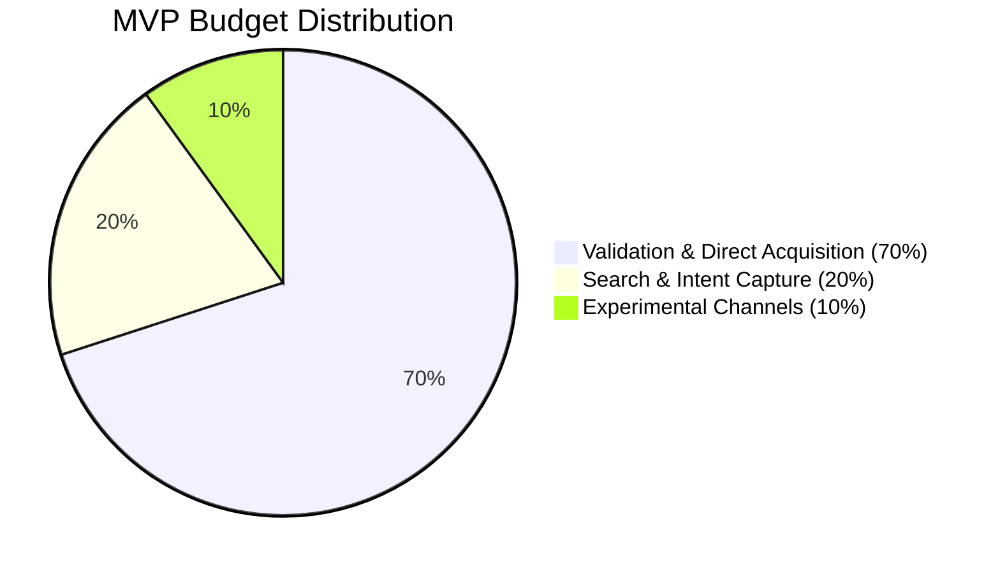

Launching a **Minimum Viable Product (MVP)** to market is one of the most critical phases in the lifecycle of any startup or new business project. The fundamental purpose of an MVP is not to generate large economic profits immediately or scale operations massively, but to **learn**. It involves validating the product's value hypothesis, evaluating real user interaction with the interface, and discovering whether there is a market willing to pay for your solution before making large investments in software development and production.

However, many founders and marketing directors make the mistake of applying traditional advertising budgets and structures to an MVP. They either inject capital massively into inefficient branding campaigns or invest budgets so ridiculously small that the advertising algorithm never exits the learning phase, obtaining biased data that leads to erroneous conclusions.

In this technical guide, we will analyze how to calculate and structure a Growth Marketing budget from scratch focused on MVP validation using solid financial rules and statistical significance formulas.

---

## 1. Calculating the Minimum Budget Based on Statistical Significance

The greatest danger of testing an MVP with scarce budgets is **statistical noise**. If you invest €200 in ads, get 2 sales, and assume you have an optimal acquisition cost, you are making strategic decisions based on chance. You need to accumulate a minimum volume of data to ensure your conversion rates reflect the real behavior of the market.

To calculate the minimum advertising budget needed to validate a conversion hypothesis, we must first determine the **minimum sample size ($N$)** required for your landing page.

### The Minimum Sample Size Formula

A simplified mathematical formula to calculate the number of visits needed to validate a test with a 95% confidence level and a 5% margin of error is:

$$N = \frac{1.96^2 \cdot p \cdot (1 - p)}{e^2}$$

*Where:*
* $p$ is the estimated or expected web conversion rate (e.g., $0.02$ if we expect a 2% landing page conversion rate).
* $e$ is the acceptable margin of error (e.g., $0.02$ if we want a 2% margin of error).

Let's do a typical calculation: if we expect a checkout conversion rate of **2%** ($p = 0.02$) with a margin of error of 1.5% ($e = 0.015$):

$$N = \frac{3.8416 \cdot 0.02 \cdot 0.98}{0.000225} = \frac{0.075295}{0.000225} \approx 335\ \text{website visits}$$

To get at least 10 or 15 stable conversions that allow analysis of the customer profile, you would need to drive approximately 350 to 500 qualified users to your sales funnel.

### Determining the Advertising Budget ($P_{min}$)

Once we know the required visits ($N$), we can calculate the minimum advertising budget needed by multiplying that traffic volume by the average **Cost Per Click (CPC)** in your sector across advertising networks (Meta, Google, LinkedIn):

$$P_{min} = N \cdot CPC_{average}$$

If the average CPC for your niche (e.g., B2B SaaS) on LinkedIn Ads is €3.00, your minimum MVP validation budget must be at least:

$$P_{min} = 335 \cdot 3.00\ \text{€} = 1,005\ \text{€}$$

Attempting to validate that SaaS MVP with a €150 budget will only generate insufficient visits from which no scientific conclusions about real customer interest can be drawn.

---

## 2. The Budget Distribution Rule: The 70 / 20 / 10 Framework

When structuring the Growth Marketing budget for an MVP, you should not concentrate all capital on a single platform or tactic. Meta Ads can saturate quickly, or Google Ads may prove excessively expensive for your main keywords. We recommend distributing your monthly budget following a classic risk allocation framework:

### 70% - Primary Direct Acquisition Channel (Push Traffic)
This is the main channel where your target audience can be found through visual or interest-based segmentation (typically Meta Ads or TikTok Ads). Its purpose is to push traffic toward your MVP landing page to test the interest of cold users (who do not know your brand).

### 20% - Intent Capture Channel (Search Traffic)
Investment in Google Ads (paid search) directed specifically at high-purchase-intent transactional keywords. If a user is actively searching Google for "buy MVP invoicing software," you need to be present. This channel serves to validate conversion among the market's highest-probability buyers.

### 10% - Experimental Channels and Retargeting
Budget allocated to basic remarketing campaigns (to re-engage users who visited the site without converting in the first session) or to experiment with alternative channels (such as niche ads or local affiliate marketing).

---

## 3. Establishing Target CPA Thresholds and Financial Viability

For MVP validation to be useful, you must define in advance what your **target Cost Per Acquisition (CPA)** or maximum viable acquisition cost is. If you are validating a €20/month SaaS subscription and your ad CPA turns out to be €150, your financial model requires a drastic restructuring.

### The Break-Even CPA Formula

To determine the maximum CPA your business can sustain before incurring net losses during the validation phase, apply the following formula:

$$CPA_{Breakeven} = \text{Average Order Value (AOV)} - COGS - \text{Unit Operating Costs}$$

*   **Practical Case:** If you sell a physical e-commerce product for €50 ($AOV = 50$), your production and import cost is €15 ($COGS = 15$), and delivery and gateway costs add up to €8 ($Operating = 8$):

$$CPA_{Breakeven} = 50\ \text{€} - 15\ \text{€} - 8\ \text{€} = 27\ \text{€}$$

If during the MVP campaign you achieve a real CPA of **€22**, your product is commercially viable at scale. If your real CPA is **€45**, the product cannot be scaled profitably through paid channels under its current structure, forcing you to optimize the web conversion rate, renegotiate the COGS, or increase the final selling price of your product.

---

## Comparative Table: Budget Strategy for MVP vs. Established Product

| Parameter | MVP Validation Phase | Established Product in Scaling Phase |
| :--- | :--- | :--- |
| **Primary Objective** | Validate value and conversion hypothesis | Maximize sales volume and net revenue |
| **Time Horizon** | Short-term (30 to 90 days) | Ongoing / continuous monthly scaling |
| **Audiences** | Broad and generic (discovery) | Segmented, LAL, and retention audiences |
| **Optimization Focus** | Conversion rate and user feedback | Net ROAS and contribution margin |
| **Success Criterion** | Statistical significance and real interest | LTV/CAC ratio above 3:1 |

## Conclusion

Structuring a Growth Marketing budget for an MVP requires a scientific mindset of rapid experimentation and financial control. By grounding the initial budget in statistical sample size formulas and distributing risk under the 70/20/10 model, you ensure that every euro invested purchases real, clean data and learnings. Crossing these results with your break-even CPA will give you the definitive answer about the commercial viability of your project before incurring major scaling operating costs.
