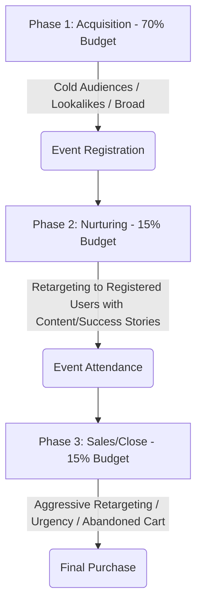

The infoproduct sector (online courses, memberships, mentoring programs, and high-ticket coaching) boasts one of the most attractive cost structures in the digital ecosystem, characterized by marginal production costs close to zero and exceptionally high gross margins. However, this high potential profitability attracts fierce competition in traffic acquisition platforms, driving up costs per click (CPC) and costs per lead.

In this environment, the financial success of a launch or an evergreen funnel (*evergreen*) does not depend on chance, but on the architecture of the conversion funnel and how you structure your campaigns in Meta Ads (Facebook and Instagram). Unlike traditional e-commerce, where purchases are usually immediate, infoproducts require an educational and trust-building process beforehand. In this technical article, we will analyze the main funnel models for infoproducts, mathematically model the ROAS calculation in launches, and detail the optimal campaign structures in Meta Ads.

---

## Types of Funnels for Infoproducts and Their Financial Dynamics

Depending on the price of the infoproduct (Price Point), the funnel structure changes drastically to adapt to the cognitive and financial effort the buyer must make:

### 1. The Direct Entry Funnel (Low-Ticket / Tripwire)
*   **Price Range:** €7 - €49.
*   **Strategy:** Direct sale using cold traffic. The main goal is not to generate a large immediate profit, but to acquire a customer at the lowest possible cost to amortize the CAC. Real profitability is obtained in the second step of the funnel (immediate Order Bumps and Upsells) or through the subsequent sale of higher-value products.

### 2. The Webinar / VSL Funnel (Mid-Ticket)
*   **Price Range:** €97 - €997.
*   **Strategy:** Users register for a free online event (live class, workshop, or video sales letter - VSL). During the 60-90 minute session, technical value is delivered, objections are resolved, and the paid offer is presented with a time limit (scarcity).

### 3. The Application / Call Funnel (High-Ticket)
*   **Price Range:** > €1,000.
*   **Strategy:** At this level, users do not buy autonomously with a credit card on a checkout page. The ad flow is oriented toward getting the qualified prospect to complete an application form and schedule a phone diagnosis session with a sales team (Closers).

---

## Mathematical Modeling of Launch Profitability (Webinar ROAS Equation)

For infoproducts sold through webinars or multi-day challenges, the final profitability is closely tied to the efficiency of cold traffic and attendance rates.

Let's define the system variables:
*   $S$: Total advertising investment (Ad Spend).
*   $CPR$: Cost Per Registration or cost per lead.
*   $N_{\text{reg}}$: Number of users registered for the event ($N_{\text{reg}} = S / CPR$).
*   $CR_{\text{show}}$: Show-up rate (*Show-up rate*). For example, if 1,000 people register and 300 attend live, the rate is $0.30\ (30\%)$.
*   $CR_{\text{sales}}$: Conversion rate from attendees to buyers.
*   $P$: Retail price of the infoproduct.

The total revenue generated ($R$) is calculated as:

$$R = N_{\text{reg}} \times CR_{\text{show}} \times CR_{\text{sales}} \times P$$

Substituting $N_{\text{reg}}$ in terms of investment and cost per lead:

$$R = \frac{S}{CPR} \times CR_{\text{show}} \times CR_{\text{sales}} \times P$$

The campaign ROAS is defined as:

$$\text{ROAS} = \frac{R}{S} = \frac{\frac{S}{CPR} \times CR_{\text{show}} \times CR_{\text{sales}} \times P}{S}$$

Simplifying the advertising spend ($S$), we get the **Fundamental ROAS Equation for Launches**:

$$\text{ROAS} = \frac{CR_{\text{show}} \times CR_{\text{sales}} \times P}{CPR}$$

> [!IMPORTANT]
> The ROAS of a webinar funnel is completely independent of the total budget invested ($S$), provided that conversion rates and cost per registration remain stable. Success depends on balancing the cost of acquiring registrations ($CPR$) with the quality and persuasiveness of the event ($CR_{\text{show}} \times CR_{\text{sales}}$).

### Practical Simulation:
*   **Course Price ($P$):** €497
*   **Cost Per Registration ($CPR$):** €3.50
*   **Show-up Rate ($CR_{\text{show}}$):** $35\%\ (0.35)$
*   **Sales Conversion Rate ($CR_{\text{sales}}$):** $4\%\ (0.04)$

We calculate the expected ROAS:
$$\text{ROAS} = \frac{0.35 \times 0.04 \times 497\ \text{€}}{3.50\ \text{€}} = \frac{0.014 \times 497}{3.50} = \frac{6.958}{3.50} = 1.988\ (\approx 2.0)$$

For every euro invested in acquisition in Meta Ads, the infoproduct creator recovers €2.00. If the $CPR$ rises to €5.00 due to market saturation, the ROAS will immediately drop to:
$$\text{ROAS} = \frac{6.958}{5.00} = 1.39$$

---

## Meta Ads Campaign Structure for Launches

For a launch structured over time (such as the classic 4-phase launch formula), the Meta Ads architecture must be segmented by clear operational phases:

### Phase 1: Acquisition (Lead Gen)
*   **Optimization Goal:** Conversion (`Lead`).
*   **Targeting:** Broad targeting (without interest segmentation, relying on creatives), Lookalikes of historical buyers, and a selection of highly relevant niche interests.
*   **Budget:** Represents between **70% and 80% of the total budget** of the campaign. Its only mission is to fill the launch email list with the lowest possible CPR.

### Phase 2: Nurturing and Consumption (Nurturing)
*   **Optimization Goal:** Conversions of micro-interactions or Reach / Video views.
*   **Targeting:** Exclusively custom retargeting of users registered in Phase 1.
*   **Creative strategy:** Show student testimonials, real success stories, and short videos that reinforce the mentor's authority or explain the conceptual pillars of the method taught in the webinar. The goal here is to elevate the $CR_{\text{show}}$ (attendance rate).

### Phase 3: Sales and Close (Cart Open)
*   **Optimization Goal:** Purchase (`Purchase`) or checkout initiation.
*   **Targeting:** Retargeting of all registered users who attended the event, users who visited the course sales page, and excluding those who have already purchased.
*   **Creative strategy:** Ads oriented toward pain points, common objections (price, time, support), last-minute bonus additions, and an interactive countdown to generate urgency (\"Cart closes in 12 hours\").

---

## Golden Rules for Budget Distribution

In short-format launches (10 to 14 total days with the cart open for 5 days), the recommended public budget distribution follows a strict guideline:

1.  **Days 1 to 8 (Acquisition Phase):** 100% of the daily investment is dedicated to acquiring registrations (Phase 1).
2.  **Days 9 to 11 (Warm-up and Event Phase):** 80% to late acquisition and 20% to nurturing retargeting campaigns to ensure webinar attendance.
3.  **Days 12 to 15 (Cart Open):** Lead acquisition stops. The daily budget is redistributed: 70% to hot sales retargeting (sales page and abandoned cart) and 30% to warm audiences (registered webinar users who have not yet visited the checkout page).

## Conclusion

Meta Ads advertising for infoproducts requires a mindset focused on full-funnel metrics, not just those of the ad platform. A low Cost Per Registration is useless if your attendance rate is low or if the sales team is unable to close scheduled leads. By modeling your campaigns, structuring the budget dynamically by launch phases, and optimizing conversions based on the target ROAS equation, you guarantee predictable and highly profitable growth for your training or consulting business.
