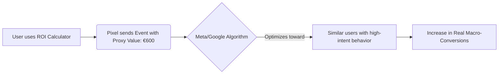

Selling impulse-purchase products (low-ticket e-commerce, fast fashion, inexpensive accessories) offers an undeniable algorithmic advantage: volume and immediacy of data. The customer journey lasts minutes, and the ad pixel (Meta Conversions API, Google Tag) receives a constant stream of purchase events in real time.

On the contrary, in **high-consideration products** (corporate B2B SaaS, high-ticket professional services, real estate sales, executive training, or luxury e-commerce), the consumer decision-making process stretches over weeks or months. The volume of final macro-conversions (confirmed sales or highly qualified leads) is low and the feedback loop is slow. As a result, the pixel becomes starved for data, campaigns fail to exit the learning phase or fall into the "Learning Limited" state, increasing advertising costs (CPM) and destroying ROI stability.

In this technical article, we will analyze how to structure and use **micro-conversions** as proxy signals to feed advertising platform algorithms, how to mathematically validate their correlation with sales, and how to implement them effectively.

---

## The Learning Phase Crisis in Long Sales Cycles

The smart bidding engines of Meta Ads and Google Ads are based on machine learning. To effectively optimize an ad set, the algorithm needs to identify common patterns among users who convert.
* **Meta's empirical rule:** Approximately **50 conversions per ad set per week** are required for the algorithm to exit the learning phase and begin stabilizing the cost per result.
* **The consequence of low volume:** If your product is a B2B software at $5{,}000\ \text{€}$ per year and your budget allows you to generate $5$ demos (macro-conversions) per week, the algorithm will permanently operate under high volatility. It will be "shooting in the dark" because the statistical sample is insufficient to predict which audience profiles have the highest propensity to convert.

To solve this, we must shift the campaign optimization objective higher up the funnel, selecting an intermediate event or **micro-conversion** that records sufficient critical mass of data while maintaining a close intentional correlation with the final sale.

---

## Micro-Conversion Mapping by Sector

A micro-conversion should not simply be a visit to the home page. It must represent a high-intent, high-cognitive-effort milestone on the part of the user.

| Vertical | Macro-Conversion (Final Objective) | Recommended Micro-Conversions (Pixel Signals) |
| :--- | :--- | :--- |
| **B2B SaaS / Services** | Scheduled demo or contract signing. | * Use of the ROI calculator on the website. * Download of technical whitepapers. * Viewing $75\%$ of the commercial demo video. * Time spent on the pricing page > 90 seconds. |
| **High-Ticket E-commerce** | Purchase of item (e.g., sofas at $2{,}000\ \text{€}$). | * Use of the 3D material configurator. * Click on "View financing" button. * Add to Cart (ATC) / Initiate Checkout (IC). * Complete reading of the reviews or FAQs section. |
| **High-Ticket Infoproducts** | Purchase of mentoring ($3{,}000\ \text{€}$). | * Registration in free webinar. * Opening of the application form. * Complete response to a diagnostic test/quiz. |

---

## Mathematical Validation of Micro-Conversions: Correlation Analysis

Optimizing your campaigns toward a micro-conversion that has no direct causal relationship with sales is a catastrophic error. You could achieve thousands of downloads of a free PDF (micro-conversion) by information-collecting users who will never buy your premium service (macro-conversion).

To technically validate a micro-conversion, we must calculate the **Conditional Transition Probability** or Micro-to-Macro Conversion Rate ($P(\text{Macro} \mid \text{Micro})$):

$$P(\text{Macro} \mid \text{Micro}) = \frac{P(\text{Macro} \cap \text{Micro})}{P(\text{Micro})} = \frac{\text{Total number of Macro-conversions}}{\text{Total number of Micro-conversions}}$$

### Numerical Case Study:
A B2B SaaS selling billing software audits its funnel data over a quarter:
* **Users who complete webinar registration:** $1{,}200$
* **Users who use the ROI Calculator on the website:** $400$
* **Final sales achieved (Macro):** $24$

We calculate the conditional probability for each micro-conversion:

#### 1. Webinar:
$$P(\text{Sale} \mid \text{Webinar}) = \frac{24\ \text{sales from webinar}}{1{,}200\ \text{registrations}} = 0.02\ (2\%)$$

#### 2. ROI Calculator:
$$P(\text{Sale} \mid \text{Calculator}) = \frac{24\ \text{sales from calculator}}{400\ \text{uses}} = 0.06\ (6\%)$$

Although the Webinar provides higher gross volume, use of the **ROI Calculator** demonstrates three times higher purchase intent ($6\%$ vs $2\%$). If the calculator volume ($400$ events per month, approximately $93$ per week) comfortably exceeds the threshold of $50$ weekly events required by the platforms, the ROI calculator is the optimal micro-conversion signal to train the pixel.

---

## Implementing Micro-Conversions in Bidding Strategies

Once the ideal micro-conversion has been identified, the operational implementation follows these steps:

### A. Assigning Proxy Financial Values (Value-Based Optimization)
For the algorithm to learn to seek high-value users, don't treat all events equally. Assign a proxy monetary value to micro-conversions based on their closing probability and the Customer Lifetime Value (LTV) or product price:

$$\text{Micro Proxy Value} = \text{Macro Value} \times P(\text{Macro} \mid \text{Micro})$$

If your average corporate contract is worth $10{,}000\ \text{€}$ and the conditional probability that a lead who uses the calculator ends up buying is $6\%$:

$$\text{Proxy Value} = 10{,}000\ \text{€} \times 0.06 = 600\ \text{€}$$

Configure this proxy value of $600\ \text{€}$ in Meta Conversions API or Google Tag Manager for the custom event `ROI_Calculator_Completed`. This enables Value-Based Bidding (Target ROAS) instead of volume-only bidding (Target CPA).

### B. The "Back-Up" Funnel Strategy (Fallback Campaign)
When launching a new account or product to market:
1. **Phase 1 (Launch):** Set campaign optimization pointing directly at the high-intent micro-conversion event (e.g., `Add to Cart` in high-end e-commerce, or `Download Demo` in SaaS). This accumulates data quickly and allows the algorithm to exit the learning phase in less than a week.
2. **Phase 2 (Maturation):** Once the micro-conversion campaign indirectly generates a constant and predictable flow of macro-conversions (more than 30–40 weekly sales at the account level), duplicate the campaign and switch the optimization objective to the final macro-conversion (`Purchase` or `Demo completed`). The pixel will already have gathered enough historical attribution data to identify the ideal net buyer profile.

## Conclusion

The success of media buying in complex markets does not depend on creative intuition, but on the quality of data you deliver to the algorithm. Do not try to optimize your campaigns for the final purchase of high-consideration products if you do not have the statistical volume necessary to feed the learning phase. Measure the conditional probability of your intermediate events, define high-intent micro-conversions, assign them economic values based on their real correlation, and use them as the necessary fuel to stabilize and scale your advertising ROI.
