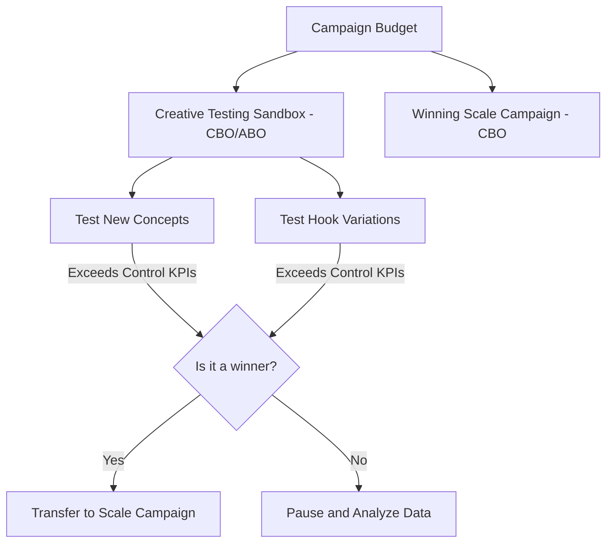

The rise of TikTok as a public advertising acquisition channel for e-commerce has redefined the rules of the performance marketing game. With its native full-screen, vertical video format and a hyper-optimized recommendation algorithm, the platform offers direct-to-consumer (D2C) brands a unique opportunity to make products go viral and capture sales at a competitive entry cost.

However, advertising on TikTok Ads carries a drastic operational challenge that brands accustomed to Meta Ads (Facebook and Instagram) often underestimate: **the ad life cycle is extremely short**. Due to the fast-paced nature of content consumption on the platform, a creative ad that reports an extraordinary ROAS today can saturate the target audience and stop being profitable in just 7 to 14 days. This phenomenon is technically known as **accelerated creative fatigue**.

In this technical guide, we will analyze why this saturation occurs, what advanced metrics you should monitor to anticipate performance drops, and how to structure your TikTok Ads account to test and scale videos in an automated and sustainable way.

---

## The Anatomy of Creative Fatigue on TikTok

On Facebook Ads, a static image or a well-produced video can run profitably for months if the audience is wide enough. On TikTok, users come to the platform to be entertained and consume dozens of videos per minute. Their brains learn to identify and skip traditional banner ads instantly.

When the frequency of exposure of your ad rises in a given target audience, three correlated negative financial effects occur:

1. **Drop in Hook Rate:** Users swipe up on your video within the first 2 seconds of playback.
2. **Increase in CPM (Cost Per Thousand Impressions):** By detecting that your content bores users or generates physical rejection (low retention rate), TikTok's auction algorithm penalizes you by increasing the viewing cost.
3. **Decrease in Net ROAS:** Cost per Acquisition (CPA) increases exponentially, eroding the online store's net advertising margin.

---

## Two Technical Metrics to Predict Saturation

In order not to make late decisions based solely on the final drop in monthly ROAS, you must audit the creative health of your ads weekly using two key video retention metrics:

### 1. Hook Rate (2-second Retention Rate)
Measures the ability of the first two seconds of your video to capture the user's visual attention and stop the continuous scroll.

$$Hook\ Rate = \frac{\text{2-Second Video Views}}{\text{Total Impressions}} \times 100$$

*   **Benchmark:** A Hook Rate below **25%** indicates that the ad's initial hook is no longer attractive or is saturated. A healthy Hook Rate should be around **35% - 50%**.

### 2. Hold Rate (6-second Retention Rate)
Evaluates the percentage of people who remain interested in the video after passing the initial hook, consuming the core of the advertising message.

$$Hold\ Rate = \frac{\text{6-Second Video Views}}{\text{Total Impressions}} \times 100$$

*   **Benchmark:** Your Hold Rate should exceed at least **10% - 15%**. If your Hook Rate is high but your Hold Rate plummets, it means your introduction was attractive (perhaps a clickbait hook) but the body of the video failed to sustain the initial promise or connect with the customer's pain point.

---

## The Recommended Account Structure: Testing Sandbox + Scaling Campaign

To maintain a flat and predictable ROAS over time, you must completely separate the creative experimentation phase from the sales scaling phase. This prevents the insertion of new unstable videos from de-optimizing mature campaigns that are already operating efficiently.

### 1. The Creative Testing Sandbox (Ad Group Budget Optimization - ABO)
The objective of this secondary campaign is to pit new concepts and creative variations against each other under controlled budgets quickly.
*   **Targeting:** Use broad audiences (Broad Targeting) without interest targeting or restrictive demographic data. Let the video content itself act as a natural targeting filter.
*   **Ad Group Structure:** Place between 3 and 5 video variations within each ad group.
*   **Golden Rule of Testing:** Modify a single variable per ad group. For example, keep the same video body and checkout page, but experiment with 3 different variations of the initial hooks (the first 2-3 seconds).

### 2. The Scaling Campaign (Campaign Budget Optimization - CBO)
The main advertising acquisition budget of the account resides here.
*   **Insertion Rules:** Only videos that have exceeded the minimum control KPIs (Hook Rate > 35%, CPA below the historical target) within the Testing Sandbox are introduced.
*   **Combined Formats:** Use both standard ads (normal paid ads pointing to the landing page) and **Spark Ads** (ads built using organic posts from the brand's account or creator/influencer profiles via authorization codes). Spark Ads tend to report higher interaction and conversion rates by integrating more seamlessly into the organic feed.

---

## Comparative Table: Ad Formats on TikTok

| Operating Parameter | Spark Ads (Organic / Creator Videos) | Non-Spark Ads (Traditional Ads) |
| :--- | :--- | :--- |
| **Ad Source** | Real post on organic brand/influencer profile | File uploaded exclusively in the Ad Manager |
| **Profile Click Destination** | Directs to creator's channel or brand profile | No organic profile, cannot click on the photo |
| **Traffic Retention** | Builds organic community on TikTok long-term | Purely transactional toward the Landing Page |
| **Average Hook Rate** | High (integrates better into the user's organic feed) | Medium-Low (has explicit ad appearance) |
| **Relative CPA** | Generally 15% - 25% cheaper | Ad auction standard |

---

## Advanced Strategies to Extend the Lifespan of Your Videos

In order not to collapse operationally by trying to produce 10 original videos per week, you can apply the following editing optimizations to get the most out of your media library:

1. **Rewrite and Swap Hooks:** 80% of a video's performance on TikTok is decided in the first 3 seconds. If you have a winning video that is starting to decline, record 3 new different introductions (changing the text hook, using a dynamic unboxing, or a provocative question) and combine them with the existing video body that already converted in the past.
2. **Use Dynamic Voiceovers (Text-to-Speech):** Use TikTok's built-in AI voices or professional platforms to change the audio message and test different sales pitches (e.g., emotional pain vs. financial pain) without needing to re-film the actor.
3. **Optimize Trending Music:** The rhythm of the music dictates the user's attention pattern on the platform. Changing the background track of your ad to the trending song of the week can reactivate interaction and temporarily reduce CPM in the auction.

## Conclusion

E-commerce on TikTok Ads is not a game of advanced targeting or precision bidding; it is a game of **creative stamina and speed**. Structuring your ad account by separating the experimentation phase (Sandbox) from the stable billing phase (Scaling Campaign), while rigorously monitoring the predictive metrics of Hook Rate and Hold Rate, is the only viable technical strategy to master the algorithm, mitigate creative fatigue, and sustain a healthy net ROAS in the long term.
