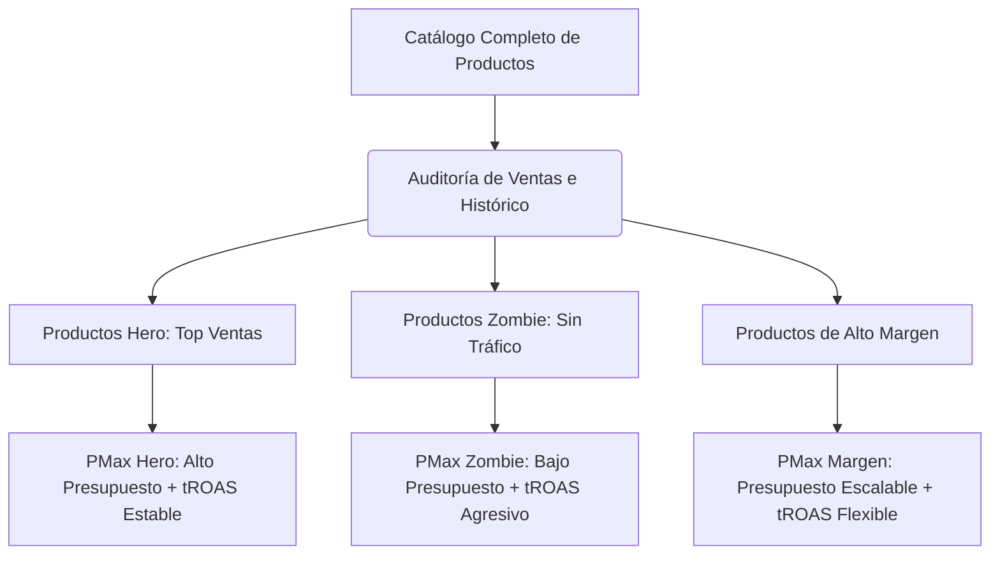

Las campañas **Performance Max (PMax)** de Google Ads se han consolidado como el estándar de oro para muchos comercios electrónicos y generadores de leads gracias a su capacidad de automatizar la puja, la segmentación y la distribución de creatividades en todos los canales de Google (Búsqueda, Shopping, YouTube, Display, Discover y Maps) desde una sola interfaz. Sin embargo, su mayor fortaleza es también su mayor debilidad: la dependencia absoluta de algoritmos de caja negra (black box).

Cualquier Media Buyer experimentado sabe que escalar el presupuesto en PMax no es un proceso lineal. Subir el presupuesto diario un $50\%$ de golpe suele provocar una caída drástica del Retorno de la Inversión Publicitaria (ROAS), un incremento descontrolado del Costo por Adquisición (CPA) y la desviación del presupuesto hacia inventario publicitario de baja calidad (como la red de Display o vídeos de relleno). En este artículo técnico, analizaremos la mecánica interna de PMax ante incrementos de presupuesto, formularemos el impacto matemático del retorno marginal decreciente y proporcionaremos una guía paso a paso para escalar de forma estable y controlada.

---

## La ley de los retornos marginales decrecientes en la publicidad programática

Para comprender por qué el rendimiento decae al escalar, debemos examinar la relación matemática entre la inversión publicitaria ($S$) y los ingresos generados ($R$). Las plataformas de anuncios funcionan bajo un modelo de subasta dinámico donde las audiencias de mayor intención de compra se agotan primero.

Podemos modelar los ingresos en función del gasto utilizando una función de producción de potencia con retornos decrecientes (curva de saturación publicitaria):

$$R(S) = \alpha \cdot S^{\beta}$$

Donde:
*   $R(S)$ representa los ingresos totales generados.
*   $S$ representa el Ad Spend o inversión publicitaria.
*   $\alpha$ es un factor de escala que mide la conversión y el valor medio de pedido (AOV) base.
*   $\beta$ es la elasticidad del gasto publicitario, donde $0 < \beta < 1$ debido a la saturación del mercado.

El ROAS medio se define como:

$$\text{ROAS} = \frac{R(S)}{S} = \alpha \cdot S^{\beta - 1}$$

Dado que $\beta - 1 < 0$, a medida que la inversión ($S$) aumenta, el ROAS medio decae de forma inexorable. 

Si queremos evaluar el rendimiento del último euro invertido (Marginal ROAS o $\text{ROAS}_{\text{m}}$), debemos derivar la función de ingresos respecto al gasto:

$$\text{ROAS}_{\text{m}} = \frac{dR}{dS} = \alpha \cdot \beta \cdot S^{\beta - 1} = \beta \cdot \text{ROAS}$$

Puesto que $\beta < 1$, el ROAS marginal es siempre inferior al ROAS medio reportado en la plataforma. Cuando escalas el presupuesto de PMax precipitadamente, el algoritmo se ve obligado a ofertar por inventarios menos cualificados para consumir el nuevo presupuesto asignado, lo que acelera la caída de $\beta$ y hunde el ROAS marginal muy por debajo de tu punto de equilibrio.

---

## El peligro de la canibalización de marca (Brand Cannibalization)

Uno de los atajos más comunes que toma el algoritmo de PMax al recibir un aumento de presupuesto es la sobrepuja por términos de búsqueda de marca (branded search). Al pujar por tus propios términos de marca ("comprar zapatos [Marca]"), PMax captura usuarios que ya tenían una alta intención de compra orgánica o directa.

Esto infla artificialmente el ROAS en el panel de control:

$$\text{ROAS}_{\text{Ficticio}} = \frac{\text{Conversiones de Marca} + \text{Conversiones Frías}}{\text{Inversión en Marca} + \text{Inversión en Frío}}$$

El algoritmo mezcla ambas fuentes de datos para mostrar un número agregado saludable, ocultando el hecho de que la inversión en audiencias frías (prospecting) está siendo totalmente ineficiente. Si el tráfico de marca representa el $80\%$ de tus conversiones PMax, el escalado del presupuesto solo incrementará el gasto en términos de marca sin aportar un volumen significativo de nuevos clientes netos.

---

## Estrategias técnicas para escalar PMax sin perder el ROAS

Para sortear el colapso del ROAS y evitar la canibalización durante el escalado, se deben aplicar las siguientes metodologías de optimización:

### 1. El método del escalado incremental controlado (Regla del 15%)
Nunca incrementes el presupuesto diario de una campaña PMax en más de un $15\% - 20\%$ de una sola vez. Los cambios bruscos desestabilizan el algoritmo de Smart Bidding y devuelven la campaña a la fase de aprendizaje activo.
*   **Procedimiento:** Aumenta el presupuesto en un $15\%$, espera un periodo de 3 a 5 días para que el CPC medio y la tasa de conversión se estabilicen, verifica que el ROAS marginal se mantenga por encima de tu objetivo y repite el proceso.

### 2. Contención y exclusión de marca activa
Para forzar a PMax a actuar como una verdadera herramienta de adquisición de nuevo tráfico:
*   Aplica **listas de exclusión de marca** a nivel de campaña. Esto impide que PMax puje por variaciones de tu nombre comercial.
*   Crea una campaña de Búsqueda tradicional independiente para tu marca con concordancia exacta y pujas manuales o ROAS objetivo muy alto. De este modo, retienes el control absoluto del CPA de marca y mantienes a PMax enfocada exclusivamente en capturar demanda externa.

### 3. Modificación coordinada de los objetivos de puja (tROAS)
Al subir el presupuesto, la tendencia natural del sistema es expandir el alcance hacia audiencias más baratas pero menos cualificadas. Para contrarrestarlo, debes ajustar la restricción de ROAS Objetivo ($\text{tROAS}$):
*   **Escalado vertical eficiente:** Al aumentar el presupuesto un $15\%$, incrementa ligeramente el objetivo de tROAS (por ejemplo, de $250\%$ a $265\%$). Esto restringe los términos de búsqueda admisibles por el algoritmo, forzándolo a buscar volumen adicional únicamente dentro de los umbrales de alta conversión en lugar de gastar en inventario Display de baja calidad.

### 4. Segmentación del catálogo por rendimiento (Estructura de Campañas Hero/Zombie)
Evita agrupar todo tu catálogo de productos en una sola campaña PMax al escalar. El algoritmo tiende a gastar la mayor parte del presupuesto en un puñado de artículos de alta demanda y deja al resto sin impresiones.
*   **Segmentación técnica:**
    *   **Campañas PMax Hero:** Dedicadas exclusivamente a tus top ventas históricos con presupuestos elevados y tROAS equilibrados.
    *   **Campañas PMax Zombie:** Agrupan productos con baja o nula visibilidad. Se configuran con presupuestos bajos y tROAS muy agresivos para pescar conversiones de oportunidad.
    *   **Campañas PMax de Alto Margen:** Enfocadas en productos que toleran un ROAS más bajo debido a su alto margen bruto.

### 5. Optimización del Feed de Datos sobre los Componentes Visuales
Si escalas el presupuesto y tus creatividades de vídeo o imagen en el grupo de recursos (Asset Group) son mediocres, Google desviará tu presupuesto hacia la Red de Búsqueda y Google Shopping porque son los canales donde tu CTR y conversión son competitivos. Si por el contrario cuentas con recursos visuales excelentes, puedes permitir que el algoritmo explore YouTube de forma rentable. Si careces de vídeos de alta calidad, a menudo es preferible estructurar campañas PMax de "solo feed" (Feed-Only), eliminando imágenes, textos y vídeos del grupo de recursos. Esto fuerza a PMax a comportarse estrictamente como una campaña de Smart Shopping tradicional, concentrando la inversión en la red de Shopping y Búsqueda, que inherentemente tienen una conversión superior.

## Conclusión

Escalar el presupuesto en Google Performance Max exige una meticulosa gestión de las restricciones que le imponemos al algoritmo. Sin exclusión de términos de marca, sin una estructura de catálogo segmentada y sin un ajuste inteligente del tROAS, el dinero adicional se perderá en impresiones de nulo valor añadido o en tráfico orgánico canibalizado. Aplica aumentos granulares, monitoriza constantemente la procedencia del tráfico y asegúrate de evaluar el ROAS marginal real para garantizar la sostenibilidad financiera de tu crecimiento.
