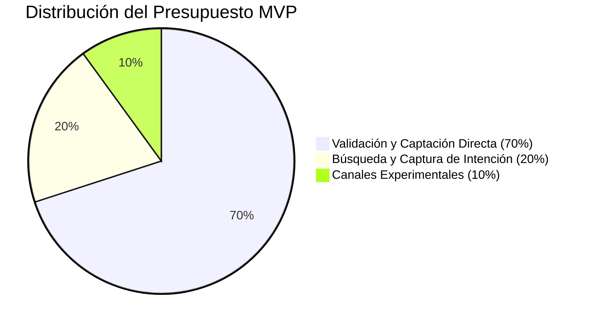

Lanzar al mercado un **Producto Mínimo Viable (MVP)** es una de las fases más críticas en el ciclo de vida de cualquier startup o nuevo proyecto empresarial. El propósito fundamental de un MVP no es generar grandes beneficios económicos de inmediato ni escalar la operación a nivel masivo, sino **aprender**. Consiste en validar la hipótesis de valor del producto, evaluar la interacción real del usuario con la interfaz y descubrir si existe un mercado dispuesto a pagar por tu solución antes de realizar grandes inversiones en desarrollo de software y producción.

Sin embargo, muchos fundadores y directores de marketing cometen el error de aplicar presupuestos y estructuras publicitarias tradicionales a un MVP. O inyectan capital de forma masiva en campañas de branding ineficientes o invierten presupuestos tan ridículamente pequeños que el algoritmo publicitario no logra salir de la fase de aprendizaje, obteniendo datos sesgados que llevan a conclusiones erróneas.

En esta guía técnica, analizaremos cómo calcular y estructurar un presupuesto de Growth Marketing desde cero enfocado en la validación de un MVP utilizando reglas financieras sólidas y fórmulas de significancia estadística.

---

## 1. El cálculo del presupuesto mínimo basado en la significancia estadística

El mayor peligro de testear un MVP con presupuestos escasos es el **ruido estadístico**. Si inviertes 200 € en anuncios, consigues 2 ventas y asumes que tienes un coste de adquisición óptimo, estás tomando decisiones estratégicas basadas en el azar. Necesitas acumular un volumen mínimo de datos para garantizar que tus tasas de conversión reflejan el comportamiento real del mercado.

Para calcular el presupuesto publicitario mínimo necesario para validar una hipótesis de conversión, debemos determinar primero el **tamaño de muestra mínimo ($N$)** requerido en tu landing page.

### La fórmula del tamaño de muestra mínimo

Una simplificación de la fórmula matemática para calcular el número de visitas necesarias para validar un test con un nivel de confianza del 95% y un margen de error del 5% es:

$$N = \frac{1.96^2 \cdot p \cdot (1 - p)}{e^2}$$

*Donde:*
* $p$ es la tasa de conversión web estimada o esperada (por ejemplo, $0.02$ si prevemos una tasa de conversión de landing page del 2%).
* $e$ es el margen de error admisible (por ejemplo, $0.02$ si queremos un margen de error del 2%).

Hagamos un cálculo típico: si esperamos una tasa de conversión de checkout del **2%** ($p = 0.02$) con un margen de error del 1.5% ($e = 0.015$):

$$N = \frac{3.8416 \cdot 0.02 \cdot 0.98}{0.000225} = \frac{0.075295}{0.000225} \approx 335\ \text{visitas en la web}$$

Para obtener al menos 10 o 15 conversiones estables que permitan analizar el perfil de los clientes, necesitarías dirigir aproximadamente a 350 - 500 usuarios calificados a tu embudo de ventas.

### Determinación del presupuesto publicitario ($P_{min}$)

Una vez que conocemos las visitas necesarias ($N$), podemos calcular el presupuesto publicitario mínimo requerido multiplicando ese volumen de tráfico por el **Coste por Clic (CPC)** promedio de tu sector en las redes publicitarias (Meta, Google, LinkedIn):

$$P_{min} = N \cdot CPC_{promedio}$$

Si el CPC promedio de tu nicho (por ejemplo, SaaS B2B) en LinkedIn Ads es de 3.00 €, tu presupuesto de validación mínima del MVP debe ser de al menos:

$$P_{min} = 335 \cdot 3.00\ \text{€} = 1.005\ \text{€}$$

Intentar validar ese MVP SaaS con un presupuesto de 150 € solo generará visitas insuficientes que no permitirán extraer ninguna conclusión científica sobre el interés real del cliente.

---

## 2. La regla de distribución del presupuesto: El marco 70 / 20 / 10

Al estructurar el presupuesto de Growth Marketing de un MVP, no debes concentrar todo el capital en una sola plataforma o táctica. Meta Ads puede saturarse rápido, o Google Ads puede resultar excesivamente caro para tus palabras clave principales. Te recomendamos distribuir tu presupuesto mensual siguiendo un marco clásico de asignación de riesgos:

### 70% - Canal de Captación Directa Primario (Tráfico de Empuje)
Consiste en el canal principal donde se encuentra tu público objetivo segmentado de forma visual o por intereses (generalmente Meta Ads o TikTok Ads). Su propósito es forzar el tráfico hacia la landing page de tu MVP para comprobar el interés de usuarios fríos (que no conocen tu marca).

### 20% - Canal de Captura de Intención (Tráfico de Búsqueda)
Inversión en Google Ads (búsqueda pagada) dirigida específicamente a palabras clave transaccionales de alta intención de compra. Si un usuario busca activamente en Google "comprar software de facturación MVP", debes estar presente. Este canal sirve para validar la conversión de los usuarios con mayor probabilidad de compra del mercado.

### 10% - Canales Experimentales y Retargeting
Presupuesto asignado a campañas de remarketing básicas (para reimpactar a los usuarios que visitaron la web y no convirtieron en la primera sesión) o para experimentar en canales alternativos (como anuncios de nicho o marketing de afiliados local).

---

## 3. Estableciendo los umbrales de CPA Objetivo y viabilidad financiera

Para que la validación del MVP sea útil, debes definir de antemano cuál es tu **Coste Por Adquisición (CPA) objetivo** o coste de adquisición máximo viable. Si estás validando una suscripción SaaS de 20 € al mes y tu CPA en anuncios resulta ser de 150 €, tu modelo financiero requiere una reestructuración drástica.

### La fórmula del CPA de Punto de Equilibrio (Breakeven CPA)

Para determinar el CPA límite que tu negocio puede soportar antes de entrar en pérdidas netas durante la fase de validación, aplica la siguiente relación:

$$CPA_{Breakeven} = Valor\ Medio\ del\ Pedido\ (AOV) - COGS - Costes\ Operativos\ Unitarios$$

*   **Caso Práctico:** Si vendes un producto físico de e-commerce a 50 € ($AOV = 50$), tu coste de producción e importación es de 15 € ($COGS = 15$) y los costes de entrega y pasarelas suman 8 € ($Operativos = 8$):

$$CPA_{Breakeven} = 50\ \text{€} - 15\ \text{€} - 8\ \text{€} = 27\ \text{€}$$

Si durante la campaña del MVP consigues un CPA real de **22 €**, tu producto es comercialmente viable a escala. Si tu CPA real es de **45 €**, el producto no se puede escalar de forma rentable mediante canales pagados bajo su estructura actual, obligándote a optimizar la tasa de conversión web, renegociar el COGS o incrementar el precio de venta final de tu producto.

---

## Tabla Comparativa: Estrategia de Presupuesto para MVP vs. Producto Consolidado

| Parámetro | Fase de Validación de MVP | Producto Consolidado en Fase de Escala |
| :--- | :--- | :--- |
| **Objetivo Principal** | Validar la hipótesis de valor y conversión | Maximizar volumen de ventas e ingresos netos |
| **Horizonte Temporal** | Corto plazo (30 a 90 días) | Indefinido / Escala mensual continua |
| **Audiencias** | Amplias y genéricas (descubrimiento) | Segmentadas, LAL y audiencias de retención |
| **Foco de Optimización** | Tasa de conversión y feedback del usuario | ROAS Neto y margen de contribución |
| **Criterio de Éxito** | Significancia estadística e interés real | LTV/CAC ratio superior a 3:1 |

## Conclusión

Estructurar un presupuesto de Growth Marketing para un MVP requiere una mentalidad científica de experimentación rápida y control financiero. Al fundamentar el presupuesto inicial en fórmulas de tamaño de muestra estadístico y distribuir el riesgo bajo el modelo 70/20/10, aseguras que cada euro invertido compre datos y aprendizajes reales y limpios. El cruce de estos resultados con tu CPA de punto de equilibrio te dará la respuesta definitiva sobre la viabilidad comercial de tu proyecto antes de incurrir en grandes gastos operativos de escalado.
