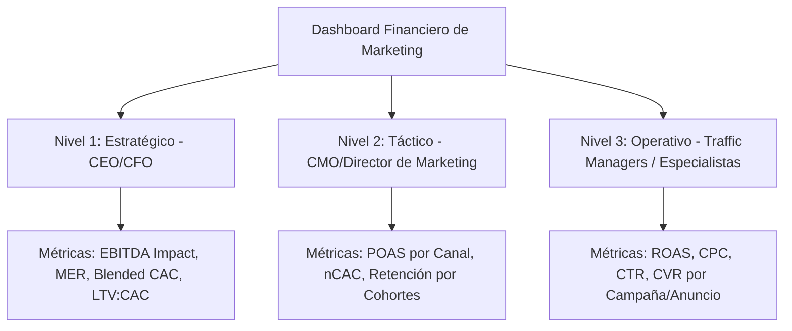

Uno de los mayores puntos de fricción dentro de las empresas en crecimiento es la falta de comunicación entre el departamento de marketing digital y el departamento de finanzas (CFO). Mientras que los especialistas en marketing suelen celebrar el incremento del CTR, el volumen de visitas o un ROAS de plataforma aparentemente alto, los directores financieros evalúan la salud del negocio basándose en el margen de contribución, el flujo de caja (Cash Flow) y el impacto real en el EBITDA.

Para tender un puente entre estas dos disciplinas, es fundamental diseñar un **dashboard financiero de marketing**. Este cuadro de mando debe ir más allá de las métricas de vanidad y centrarse en KPIs (Key Performance Indicators) que conecten la inversión publicitaria con la rentabilidad real de la empresa.

En esta guía definitiva, definiremos matemáticamente los KPIs financieros esenciales para marketing, explicaremos su relevancia para la toma de decisiones y propondremos una estructura de tres niveles para organizar tu tablero de control corporativo.

---

## 1. Los KPIs Financieros Clave de Marketing: Definiciones y Fórmulas

A continuación, analizamos las métricas fundamentales que deben regir el análisis financiero de cualquier estrategia de adquisición digital.

### 1. Coste de Adquisición de Clientes (CAC)
El CAC representa el coste medio total incurrido para adquirir un nuevo cliente durante un periodo específico. 

$$\text{CAC} = \frac{\text{Gastos de Marketing} + \text{Costes de Ventas} + \text{Gastos de Personal asociados}}{\text{Número de Nuevos Clientes Adquiridos}}$$

Es vital que el numerador no solo contenga la inversión en anuncios (Ad Spend), sino también las tarifas de las agencias de marketing, las licencias de software utilizadas para captación y los salarios prorrateados de los equipos comerciales y de marketing.

### 2. Valor del Ciclo de Vida del Cliente (LTV)
El LTV calcula el beneficio neto total que se espera que un cliente aporte al negocio a lo largo de toda su relación comercial.

Una fórmula básica para calcular el LTV es:

$$\text{LTV} = \text{Valor Medio del Pedido (AOV)} \times \text{Frecuencia de Compra} \times \text{Vida Media del Cliente} \times \text{Margen Bruto (\% en decimales)}$$

La relación entre LTV y CAC es el mejor indicador de la viabilidad de un modelo de negocio a largo plazo. La regla general de la industria dicta que:
*   **LTV : CAC < 1.0:** El negocio pierde dinero con cada cliente adquirido (camino a la quiebra).
*   **LTV : CAC = 3.0 (3:1):** Ratio ideal para un crecimiento saludable y sostenible.
*   **LTV : CAC > 5.0:** El negocio es muy rentable, pero podría estar invirtiendo poco y perdiendo cuota de mercado frente a competidores más agresivos.

### 3. ROAS (Return on Ad Spend)
El ROAS mide los ingresos brutos generados por cada unidad monetaria invertida en publicidad.

$$\text{ROAS} = \frac{\text{Ingresos Generados por Ads}}{\text{Inversión Publicitaria (Ad Spend)}}$$

Aunque es el KPI más común en las plataformas publicitarias, el ROAS tiene una limitación severa: no tiene en cuenta el coste del producto (COGS), ni las devoluciones, ni las comisiones de pago. Operar guiándose únicamente por el ROAS puede llevar a la falsa creencia de que una campaña es rentable cuando en realidad está perdiendo dinero debido a márgenes reducidos.

### 4. POAS (Profit on Ad Spend)
Para resolver las deficiencias del ROAS, los negocios con mayor control analítico utilizan el POAS. Este KPI mide el beneficio bruto real generado por la publicidad frente al gasto publicitario.

$$\text{POAS} = \frac{\text{Beneficio Bruto de Ventas por Ads}}{\text{Inversión Publicitaria (Ad Spend)}}$$

Donde:
$$\text{Beneficio Bruto} = \text{Ingresos por Ads} - \text{COGS} - \text{Costes de Envío} - \text{Comisiones de Pago}$$

*   Un **POAS > 1.0** indica que las campañas publicitarias están generando un beneficio neto positivo después de cubrir todos los costes del producto y su envío.
*   Un **POAS < 1.0** significa que la publicidad está erosionando el capital del negocio con cada venta realizada.

### 5. MER (Marketing Efficiency Ratio) o ROAS Blended
El MER ofrece una vista macroscópica de la eficiencia del marketing, relacionando la facturación total de la compañía con el gasto total en publicidad.

$$\text{MER} = \frac{\text{Ingresos Totales del Negocio}}{\text{Inversión Publicitaria Total}}$$

Esta métrica es clave en la era posterior a iOS 14, donde la atribución directa en plataformas publicitarias se ha vuelto menos precisa. El MER te permite ver el impacto real agregado de tus inversiones de pago sobre el total de ventas (incluyendo canales orgánicos, directos y recomendados).

### 6. nCAC (New Customer Acquisition Cost)
Distingue el coste de adquirir un cliente nuevo frente a la inversión en retener o incentivar compras recurrentes en clientes existentes (retargeting).

$$\text{nCAC} = \frac{\text{Inversión en Ads de Captación (Prospecting)}}{\text{Total de Nuevos Clientes Adquiridos}}$$

Supervisar el nCAC de forma aislada permite saber si la maquinaria de crecimiento de la empresa sigue siendo eficiente para atraer nuevas audiencias al ecosistema.

---

## 2. Estructura del Dashboard en Tres Niveles

Para que un dashboard financiero de marketing sea operativo, no debe saturar a los usuarios con datos innecesarios. Debe organizarse en tres niveles de reporte según el rol de la persona que lo consuma:

### Nivel 1: Vista Estratégica (Destinado a: CEO, CFO, Inversores)
*   **Objetivo:** Evaluar la viabilidad y salud financiera del negocio a nivel corporativo.
*   **KPIs Clave:** MER, Blended CAC, Relación LTV:CAC, Contribución del Marketing al EBITDA, Inversión total de marketing frente a ingresos totales (%).
*   **Frecuencia de análisis:** Mensual o Trimestral.

### Nivel 2: Vista Táctica (Destinado a: CMO, Director de Marketing)
*   **Objetivo:** Optimizar la asignación presupuestaria entre canales y productos.
*   **KPIs Clave:** POAS por canal de adquisición, nCAC frente a LTV de cohorte, Tasa de retención de clientes en primera compra, Costes de producción de contenido frente a rendimiento orgánico.
*   **Frecuencia de análisis:** Semanal o Quincenal.

### Nivel 3: Vista Operativa (Destinado a: Traffic Managers, Especialistas en Ads/SEO)
*   **Objetivo:** Ajustar pujas, creativos y copies en tiempo real.
*   **KPIs Clave:** ROAS nominal en plataforma (Meta/Google), Coste por Clic ($CPC$), Tasa de Conversión ($CVR$), Puntuación de calidad (Quality Score), CTR de creativos.
*   **Frecuencia de análisis:** Diaria o Interdiaria.

---

## 3. Integración de Datos y Buenas Prácticas Técnicas

Para construir un dashboard robusto y automatizado que minimice el error humano, sigue estas directrices metodológicas:

1.  **Conexión de Fuentes Unificada:** Utiliza herramientas de Business Intelligence (como Looker Studio, PowerBI o Tableau) conectadas a conectores automáticos (Supermetrics, Funnel.io) para extraer datos en tiempo real de Meta Ads, Google Ads, TikTok Ads y tus plataformas transaccionales (Shopify, WooCommerce, Stripe).
2.  **Sincronización con ERP/CRM:** Para calcular el LTV y el beneficio bruto real (POAS), el dashboard debe recibir los datos de costes reales del ERP de la empresa y la tasa de conversión final desde el CRM.
3.  **Alineación de Monedas y Tasas:** Asegúrate de que todas las plataformas conviertan sus gastos a una única moneda base utilizando la tasa de cambio del día correspondiente para evitar distorsiones de margen en mercados internacionales.

## Conclusión

El diseño de un dashboard financiero de marketing digital transforma el análisis publicitario de un centro de costes a un motor de inversión estratégica. Al pasar de evaluar las campañas mediante el simple ROAS a medirlas con indicadores de beneficio bruto y eficiencia agregada como el POAS y el MER, garantizarás que cada euro invertido en publicidad contribuya directamente al crecimiento del EBITDA y al beneficio neto consolidado de la empresa.
