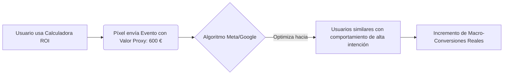

Vender productos de compra por impulso (low-ticket e-commerce, moda rápida, accesorios económicos) ofrece una ventaja algorítmica innegable: el volumen y la inmediatez de los datos. El recorrido del cliente (customer journey) dura minutos y el píxel de anuncios (Meta Conversions API, Google Tag) recibe un flujo constante de eventos de compra en tiempo real. 

Por el contrario, en los **productos de alta consideración** (B2B SaaS corporativo, servicios profesionales high-ticket, venta de inmuebles, formación ejecutiva o e-commerce de lujo), el proceso de toma de decisiones del consumidor se dilata semanas o meses. El volumen de macro-conversiones finales (ventas confirmadas o leads hipercalificados) es reducido y el ciclo de retroalimentación es lento. Como resultado, el píxel se queda hambriento de datos, las campañas no logran salir de la fase de aprendizaje o caen en el estado de "Aprendizaje limitado" (Learning Limited), incrementando los costes publicitarios (CPM) y destruyendo la estabilidad del ROI.

En este artículo técnico, analizaremos cómo estructurar y utilizar las **micro-conversiones** como señales proxy para alimentar los algoritmos de las plataformas publicitarias, cómo validar matemáticamente su correlación con las ventas y cómo implementarlas eficazmente.

---

## La crisis de la fase de aprendizaje en ciclos de venta largos

Los motores de puja inteligentes de Meta Ads y Google Ads se basan en el aprendizaje automático (Machine Learning). Para optimizar eficazmente un conjunto de anuncios, el algoritmo necesita identificar patrones comunes entre los usuarios que convierten.
*   **La regla empírica de Meta:** Se requieren aproximadamente **50 conversiones por conjunto de anuncios a la semana** para que el algoritmo salga de la fase de aprendizaje y comience a estabilizar el coste por resultado.
*   **La consecuencia del bajo volumen:** Si tu producto es un software B2B de $5.000\ \text{€}$ al año y tu presupuesto te permite generar $5$ demostraciones (macro-conversiones) semanales, el algoritmo operará permanentemente bajo una alta volatilidad. Estará dando "palos de ciego" porque la muestra estadística es insuficiente para predecir qué perfiles de audiencia tienen mayor propensión a la conversión.

Para solucionar esto, debemos desplazar el objetivo de optimización de la campaña hacia arriba en el embudo (funnel), seleccionando un evento intermedio o **micro-conversión** que registre la suficiente masa crítica de datos, pero que mantenga una estrecha correlación de intención con la venta final.

---

## Mapeo de Micro-conversiones por Sector

Una micro-conversión no debe ser simplemente una visita a la página de inicio. Debe representar un hito de alta intención y esfuerzo cognitivo por parte del usuario.

| Vertical | Macro-conversión (Objetivo Final) | Micro-conversiones Recomendadas (Señales de Píxel) |
| :--- | :--- | :--- |
| **B2B SaaS / Servicios** | Demo agendada o firma de contrato. | * Uso de la calculadora de ROI en la web. * Descarga de whitepapers técnicos. * Visualización del $75\%$ del vídeo de demo comercial. * Permanencia en la página de precios > 90 segundos. |
| **E-commerce High-Ticket** | Compra de artículo (ej. sofás de $2.000\ \text{€}$). | * Uso del configurador 3D de materiales. * Clic en el botón "Ver financiación". * Añadir al carrito (ATC) / Iniciar Pago (IC). * Lectura completa de la sección de opiniones o FAQs. |
| **Infoproductos High-Ticket** | Compra de mentoría ($3.000\ \text{€}$). | * Registro en webinar gratuito. * Apertura del formulario de aplicación. * Respuesta completa a un test/quiz de diagnóstico. |

---

## Validación Matemática de Micro-conversiones: El Análisis de Correlación

Optimizar tus campañas hacia una micro-conversión que no tiene una relación causal directa con las ventas es un error catastrófico. Podrías conseguir miles de descargas de un PDF gratuito (micro-conversión) realizadas por usuarios recolectores de información que jamás comprarán tu servicio premium (macro-conversión).

Para validar técnicamente una micro-conversión, debemos calcular la **Probabilidad de Transición Condicional** o Tasa de Conversión de Micro a Macro ($P(\text{Macro} \mid \text{Micro})$):

$$P(\text{Macro} \mid \text{Micro}) = \frac{P(\text{Macro} \cap \text{Micro})}{P(\text{Micro})} = \frac{\text{Número total de Macro-conversiones}}{\text{Número total de Micro-conversiones}}$$

### Caso de Estudio Numérico:
Un B2B SaaS que vende software de facturación audita los datos de su embudo durante un trimestre:
*   **Usuarios que completan el registro a un Webinar:** $1.200$
*   **Usuarios que utilizan la Calculadora de ROI en la web:** $400$
*   **Ventas finales logradas (Macro):** $24$

Calculamos la probabilidad condicional para cada micro-conversión:

#### 1. Webinar:
$$P(\text{Venta} \mid \text{Webinar}) = \frac{24\ \text{ventas procedentes de webinar}}{1.200\ \text{registros}} = 0,02\ (2\%)$$

#### 2. Calculadora de ROI:
$$P(\text{Venta} \mid \text{Calculadora}) = \frac{24\ \text{ventas procedentes de calculadora}}{400\ \text{usos}} = 0,06\ (6\%)$$

Aunque el Webinar aporta mayor volumen bruto, el uso de la **Calculadora de ROI** demuestra una intención de compra tres veces superior ($6\%$ vs $2\%$). Si el volumen de la calculadora ($400$ eventos al mes, aprox. $93$ por semana) supera holgadamente el umbral de los $50$ eventos semanales exigidos por las plataformas, la calculadora de ROI es la señal de micro-conversión óptima para entrenar al píxel.

---

## Implementación de Micro-conversiones en Estrategias de Puja

Una vez identificada la micro-conversión idónea, la implementación operativa sigue estos pasos:

### A. Asignación de Valores Financieros Proxy (Value-Based Optimization)
Para que el algoritmo aprenda a buscar usuarios de valor, no trates todos los eventos por igual. Asigna un valor monetario proxy a las micro-conversiones en base a su probabilidad de cierre y el Customer Lifetime Value (LTV) o el precio del producto:

$$\text{Valor Proxy de Micro} = \text{Valor Macro} \times P(\text{Macro} \mid \text{Micro})$$

Si tu contrato medio corporativo vale $10.000\ \text{€}$ y la probabilidad condicional de que un lead que usa la calculadora acabe comprando es del $6\%$:

$$\text{Valor Proxy} = 10.000\ \text{€} \times 0,06 = 600\ \text{€}$$

Configura este valor proxy de $600\ \text{€}$ en Meta Conversions API o Google Tag Manager para el evento personalizado `Calculadora_ROI_Completada`. Esto permite activar pujas basadas en valor (Value-Based Bidding / ROAS Objetivo) en lugar de pujas basadas únicamente en volumen (CPA Objetivo).

### B. La Estrategia del Embudo de "Back-Up" (Fallback Campaign)
Cuando lances una nueva cuenta o producto al mercado:
1.  **Fase 1 (Arranque):** Configura la optimización de la campaña apuntando directamente al evento de micro-conversión de alta intención (ej. `Añadir al carrito` en e-commerce de alta gama, o `Descargar Demo` en SaaS). Esto acumula datos rápidamente y permite al algoritmo salir de la fase de aprendizaje en menos de una semana.
2.  **Fase 2 (Maduración):** Una vez que la campaña de micro-conversión genera de forma indirecta un flujo constante y predecible de macro-conversiones (más de 30-40 ventas semanales a nivel de cuenta), duplica la campaña y cambia el objetivo de optimización a la macro-conversión final (`Compra` o `Demo completada`). El píxel ya habrá recopilado suficientes datos históricos de atribución para identificar el perfil ideal del comprador neto.

## Conclusión

El éxito de la compra de medios en mercados complejos no depende de la intuición creativa, sino de la calidad de los datos que entregas al algoritmo. No intentes optimizar tus campañas para la compra final de productos de alta consideración si no cuentas con el volumen estadístico necesario para alimentar la fase de aprendizaje. Mide la probabilidad condicional de tus eventos intermedios, define micro-conversiones de alta intención, asígnales valores económicos basados en su correlación real y utilízalas como el combustible necesario para estabilizar y escalar tu ROI publicitario.
