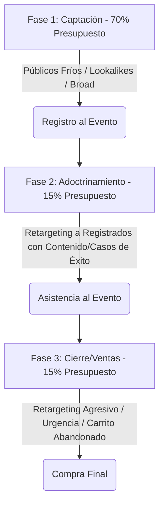

El sector de los infoproductos (cursos online, membresías, programas de mentoría y coaching high-ticket) cuenta con una de las estructuras de costos más atractivas del ecosistema digital, caracterizada por costos marginales de producción cercanos a cero y márgenes brutos excepcionalmente altos. Sin embargo, esta alta rentabilidad potencial atrae una competencia feroz en las plataformas de compra de tráfico, elevando los costos por clic (CPC) y por lead.

En este entorno, el éxito financiero de un lanzamiento o de un embudo (funnel) siempre verde (evergreen) no depende del azar, sino de la arquitectura del embudo de conversión y de cómo estructures tus campañas en Meta Ads (Facebook e Instagram). A diferencia del e-commerce tradicional, donde la compra suele ser inmediata, los infoproductos exigen un proceso educativo y de generación de confianza previo. En este artículo técnico, analizaremos los principales modelos de embudos para infoproductos, modelaremos matemáticamente el cálculo de ROAS en lanzamientos y detallaremos las estructuras de campaña óptimas en Meta Ads.

---

## Tipos de Embudos para Infoproductos y su Dinámica Financiera

Dependiendo del precio del infoproducto (Price Point), la estructura del embudo cambia drásticamente para adaptarse al esfuerzo cognitivo y económico que debe realizar el comprador:

### 1. El Embudo de Entrada Directa (Low-Ticket / Tripwire)
*   **Rango de Precio:** $7\ \text{€} - 49\ \text{€}$.
*   **Estrategia:** Venta directa mediante tráfico frío. El objetivo principal no es generar un gran beneficio inmediato, sino adquirir un cliente al menor costo posible para amortizar el CAC. La rentabilidad real se obtiene en el segundo paso del embudo (Order Bumps y Upsells inmediatos) o mediante la venta posterior de productos de mayor valor.

### 2. El Embudo de Webinar / VSL (Mid-Ticket)
*   **Rango de Precio:** $97\ \text{€} - 997\ \text{€}$.
*   **Estrategia:** Los usuarios se registran para un evento online gratuito (clase en directo, taller o vídeo de ventas interactivo - VSL). Durante la sesión de 60-90 minutos, se aporta valor técnico, se resuelven objeciones y se presenta la oferta de pago con un límite de tiempo (escasez).

### 3. El Embudo de Aplicación / Llamada (High-Ticket)
*   **Rango de Precio:** $> 1.000\ \text{€}$.
*   **Estrategia:** A este nivel, los usuarios no compran de manera autónoma con tarjeta de crédito en una página de checkout. El flujo publicitario se orienta a que el prospecto cualificado complete un formulario de aplicación y agende una sesión de diagnóstico telefónico con un equipo de asesores de ventas (Closers).

---

## Modelado Matemático de Rentabilidad en Lanzamientos (Ecuación del ROAS de Webinar)

Para los infoproductos vendidos mediante seminarios web (webinars) o retos de varios días, la rentabilidad final está estrechamente ligada a la eficiencia del tráfico frío y a las tasas de asistencia.

Definamos las variables del sistema:
*   $S$: Inversión publicitaria total (Ad Spend).
*   $CPR$: Costo por Registro (Cost Per Registration o costo por lead).
*   $N_{\text{reg}}$: Número de usuarios registrados para el evento ($N_{\text{reg}} = S / CPR$).
*   $CR_{\text{show}}$: Tasa de asistencia al evento (Show-up rate). Por ejemplo, si se registran $1.000$ personas y asisten en directo $300$, la tasa es de $0,30\ (30\%)$.
*   $CR_{\text{sales}}$: Tasa de conversión de asistentes a compradores.
*   $P$: Precio de venta del infoproducto.

Los ingresos totales generados ($R$) se calculan como:

$$R = N_{\text{reg}} \times CR_{\text{show}} \times CR_{\text{sales}} \times P$$

Sustituyendo $N_{\text{reg}}$ en función de la inversión y el costo por lead:

$$R = \frac{S}{CPR} \times CR_{\text{show}} \times CR_{\text{sales}} \times P$$

El ROAS de la campaña se define como:

$$\text{ROAS} = \frac{R}{S} = \frac{\frac{S}{CPR} \times CR_{\text{show}} \times CR_{\text{sales}} \times P}{S}$$

Simplificando el gasto publicitario ($S$), obtenemos la **Ecuación Fundamental del ROAS para Lanzamientos**:

$$\text{ROAS} = \frac{CR_{\text{show}} \times CR_{\text{sales}} \times P}{CPR}$$

> [!IMPORTANT]
> El ROAS de un embudo de webinar es totalmente independiente del presupuesto total invertido ($S$), siempre que las tasas de conversión y el costo por registro se mantengan estables. El éxito depende de equilibrar el costo de adquisición de registros ($CPR$) con la calidad y capacidad de persuasión del evento ($CR_{\text{show}} \times CR_{\text{sales}}$).

### Simulación Práctica:
*   **Precio del Curso ($P$):** $497\ \text{€}$
*   **Costo por Registro ($CPR$):** $3,50\ \text{€}$
*   **Tasa de Asistencia ($CR_{\text{show}}$):** $35\%\ (0,35)$
*   **Tasa de Cierre ($CR_{\text{sales}}$):** $4\%\ (0,04)$

Calculamos el ROAS esperado:
$$\text{ROAS} = \frac{0,35 \times 0,04 \times 497\ \text{€}}{3,50\ \text{€}} = \frac{0,014 \times 497}{3,50} = \frac{6,958}{3,50} = 1,988\ (\approx 2,0)$$

Por cada euro invertido en captación en Meta Ads, el infoproductor recupera $2,0\ \text{€}$. Si el $CPR$ sube a $5,00\ \text{€}$ debido a la saturación del mercado, el ROAS caerá inmediatamente a:
$$\text{ROAS} = \frac{6,958}{5,00} = 1,39$$

---

## Estructura de Campañas en Meta Ads para Lanzamientos

Para un lanzamiento estructurado en el tiempo (como la clásica fórmula de lanzamiento en 4 fases), la arquitectura de Meta Ads debe segmentarse por fases operativas claras:

### Fase 1: Captación (Lead Gen)
*   **Objetivo de Optimización:** Conversión (`Cliente potencial` / `Lead`).
*   **Segmentación:** Públicos amplios (Broad targeting sin segmentación de intereses, confiando en las creatividades), Lookalikes de compradores históricos y una selección de intereses nicho de alta relevancia.
*   **Presupuesto:** Representa entre el **$70\%$ y el $80\%$ del presupuesto total** de la campaña. Su única misión es llenar la lista de correo del lanzamiento con el menor CPR posible.

### Fase 2: Adoctrinamiento y Consumo (Nurturing)
*   **Objetivo de Optimización:** Conversiones de micro-interacciones o Alcance / Reproducciones de vídeo.
*   **Segmentación:** Exclusivamente retargeting personalizado de los usuarios registrados en la Fase 1.
*   **Estrategia creativa:** Mostrar testimonios de alumnos, casos de éxito reales y vídeos cortos que refuercen la autoridad del mentor o expliquen los pilares conceptuales del método que se enseñará en el webinar. El objetivo aquí es elevar el $CR_{\text{show}}$ (tasa de asistencia).

### Fase 3: Ventas y Cierre (Cart Open)
*   **Objetivo de Optimización:** Compra (`Purchase`) o inicio de pago en la web.
*   **Segmentación:** Retargeting de todos los registrados que asistieron al evento, usuarios que visitaron la página de ventas del curso y excluyendo a los que ya han comprado.
*   **Estrategia creativa:** Anuncios orientados al dolor, objeciones comunes (precio, tiempo, soporte), bonos adicionales de última hora y cuenta atrás interactiva para generar urgencia ("El carrito cierra en 12 horas").

---

## Reglas de Oro para la Distribución del Presupuesto

En lanzamientos de formato corto (10 a 14 días totales con carrito abierto durante 5 días), la distribución recomendada del presupuesto publicitario sigue una pauta estricta:

1.  **Días 1 a 8 (Fase de Captación):** $100\%$ de la inversión diaria se dedica a captar registros (Fase 1).
2.  **Días 9 a 11 (Fase de Calentamiento y Evento):** $80\%$ a captación de rezagados y $20\%$ a campañas de retargeting de adoctrinamiento para asegurar la asistencia al webinar.
3.  **Días 12 a 15 (Apertura de Carrito):** Se detiene la captación de leads. El presupuesto diario se redistribuye: $70\%$ a retargeting de ventas caliente (página de ventas y carrito abandonado) y $30\%$ a audiencias templadas (registrados al webinar que aún no han visitado la página de pago).

## Conclusión

La publicidad en Meta Ads para infoproductos exige una mentalidad centrada en las métricas del embudo completo, no solo en las de la plataforma publicitaria. Un Costo por Registro bajo no sirve de nada si tu tasa de asistencia es baja o si el equipo de ventas no tiene la capacidad de cerrar los leads agendados. Al modelar tus campañas estructurando el presupuesto de forma dinámica por fases de lanzamiento y optimizando las conversiones en base a la ecuación del ROAS objetivo, garantizas un crecimiento predecible y altamente rentable para tu negocio de formación o consultoría.
