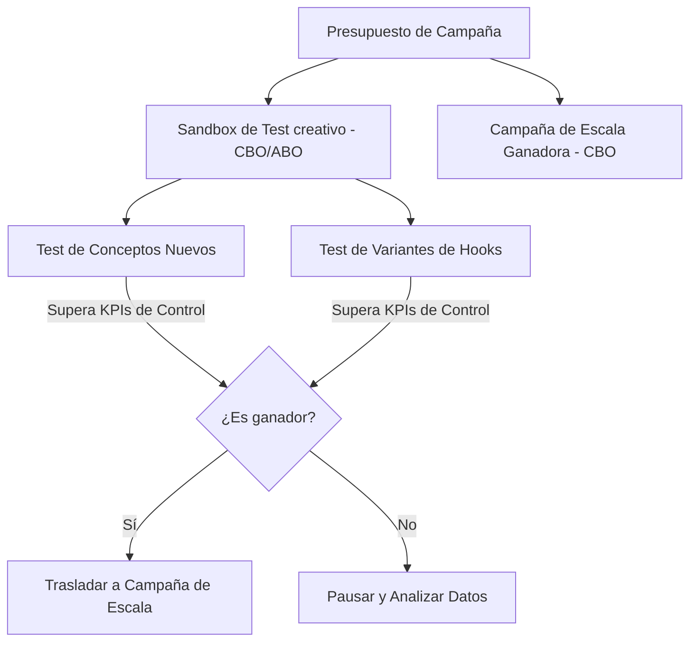

El auge de TikTok como canal de adquisición publicitaria para el comercio electrónico ha redefinido las reglas del juego del marketing de resultados. Con su formato nativo de video a pantalla completa y vertical y un algoritmo de recomendación hiperoptimizado, la plataforma ofrece a las marcas directas al consumidor (D2C) una oportunidad única para viralizar productos y capturar ventas con un coste de entrada competitivo.

Sin embargo, hacer publicidad en TikTok Ads conlleva un reto operativo drástico que las marcas acostumbradas a Meta Ads (Facebook e Instagram) suelen subestimar: **el ciclo de vida del anuncio es extremadamente corto**. Debido a la naturaleza de consumo rápido de contenido de la plataforma, un anuncio creativo que reporta un ROAS extraordinario hoy puede saturar al público objetivo y dejar de ser rentable en apenas 7 a 14 días. Este fenómeno se conoce técnicamente como **fatiga del creativo acelerada**.

En esta guía técnica, analizaremos por qué se produce esta saturación, qué métricas avanzadas debes monitorear para anticipar la caída del rendimiento y cómo estructurar tu cuenta de TikTok Ads para probar y escalar videos de forma automatizada y sostenible.

---

## La anatomía de la fatiga creativa en TikTok

En Facebook Ads, una imagen estática o un video bien producido puede funcionar de manera rentable durante meses si el público es lo suficientemente amplio. En TikTok, los usuarios acuden a la plataforma a entretenerse y consumen decenas de videos por minuto. Su cerebro aprende a identificar y omitir anuncios publicitarios tradicionales al instante.

Cuando la frecuencia de exposición de tu anuncio sube en un público objetivo determinado, se producen tres efectos financieros negativos correlacionados:

1. **Caída del Hook Rate (Tasa de Enganche):** Los usuarios deslizan hacia arriba (swipe) tu video en los primeros 2 segundos de reproducción.
2. **Aumento del CPM (Coste por Mil Impresiones):** Al detectar que tu contenido aburre o genera rechazo físico (baja tasa de retención), el algoritmo de subasta de TikTok te penaliza encareciendo el coste de visualización.
3. **Disminución del ROAS Neto:** El Coste por Adquisición (CPA) se incrementa de forma exponencial, erosionando el margen neto publicitario de la tienda en línea.

---

## Dos métricas técnicas para predecir la saturación

Para no tomar decisiones tardías basadas únicamente en la caída final del ROAS mensual, debes auditar semanalmente la salud creativa de tus anuncios mediante dos métricas clave de retención de video:

### 1. Hook Rate (Tasa de Gancho / Retención a 2s)
Mide la capacidad de los primeros dos segundos de tu video para capturar la atención visual del usuario y frenar el scroll continuo.

$$Hook\ Rate = \frac{Reproducciones\ de\ Video\ de\ 2\ segundos}{Impresiones\ Totales} \times 100$$

*   **Benchmark:** Un Hook Rate por debajo del **25%** indica que el gancho inicial del anuncio ha dejado de ser atractivo o está saturado. Un Hook Rate saludable debe rondar el **35% - 50%**.

### 2. Hold Rate (Tasa de Retención a 6s)
Evalúa el porcentaje de personas que permanecen interesadas en el video después de superar el gancho inicial, consumiendo el núcleo del mensaje publicitario.

$$Hold\ Rate = \frac{Reproducciones\ de\ Video\ de\ 6\ segundos}{Impresiones\ Totales} \times 100$$

*   **Benchmark:** Tu Hold Rate debe superar al menos el **10% - 15%**. Si tu Hook Rate es alto pero tu Hold Rate cae en picado, significa que tu introducción fue atractiva (quizás un gancho clickbait) pero el cuerpo del video no logró sostener la promesa inicial ni conectar con el dolor del cliente.

---

## La estructura de cuenta recomendada: Sandbox de Test + Campaña de Escala

Para mantener un ROAS plano y predecible a lo largo del tiempo, debes separar por completo la fase de experimentación creativa de la fase de escala de ventas. Esto evita que la inserción de nuevos videos inestables desoptimice las campañas maduras que ya operan con eficiencia.

### 1. El Sandbox de Test Creativo (Campaign Budget Optimization - ABO)
El objetivo de esta campaña secundaria es enfrentar nuevos conceptos y variaciones creativas entre sí bajo presupuestos controlados de manera rápida.
*   **Segmentación:** Utiliza audiencias amplias (Broad Targeting) sin segmentación por intereses ni datos demográficos restrictivos. Deja que el propio contenido del video actúe como filtro natural de segmentación.
*   **Estructura del Ad Group:** Coloca entre 3 y 5 variaciones de video dentro de cada grupo de anuncios.
*   **Regla de Oro del Test:** Modifica una única variable por grupo de anuncios. Por ejemplo, mantén el mismo cuerpo de video y el mismo checkout, pero experimenta con 3 variaciones diferentes de los ganchos iniciales (los primeros 2-3 segundos).

### 2. La Campaña de Escala (Campaign Budget Optimization - CBO)
Aquí reside el presupuesto principal de adquisición publicitaria de la cuenta. 
*   **Reglas de Inserción:** Solo se introducen los videos que hayan superado los KPIs mínimos de control (Hook Rate > 35%, CPA por debajo del objetivo histórico) dentro del Sandbox de Test.
*   **Formatos Combinados:** Utiliza tanto anuncios estándar (anuncios pagados normales dirigidos a la landing page) como **Spark Ads** (anuncios construidos utilizando publicaciones orgánicas de la cuenta de la marca o de perfiles de creadores/influencers mediante códigos de autorización). Los Spark Ads tienden a reportar tasas de interacción y conversión superiores al integrarse de forma más fluida en el feed orgánico.

---

## Tabla Comparativa: Formatos de Anuncios en TikTok

| Parámetro Operativo | Spark Ads (Vídeos Orgánicos / Creadores) | Non-Spark Ads (Anuncios Tradicionales) |
| :--- | :--- | :--- |
| **Origen del Anuncio** | Post real en perfil orgánico de marca/influencer | Archivo subido exclusivamente en el Ad Manager |
| **Destino del Clic en Perfil** | Dirige directamente al canal del creador o perfil | No hay perfil orgánico, no se puede hacer clic en la foto |
| **Retención del Tráfico** | Construye comunidad orgánica en TikTok a largo plazo | Puramente transaccional hacia la Landing Page |
| **Hook Rate Promedio** | Alto (se integra mejor en el feed orgánico del usuario) | Medio-Bajo (tiene apariencia explícita de anuncio) |
| **CPA Relativo** | Generalmente un 15% - 25% más económico | Estándar de la subasta publicitaria |

---

## Estrategias avanzadas para alargar la vida útil de tus videos

Para no colapsar operativamente intentando producir 10 videos originales por semana, puedes aplicar las siguientes optimizaciones de montaje para exprimir al máximo tu biblioteca multimedia:

1. **Reescribir e intercambiar Hooks:** El 80% del rendimiento de un video en TikTok se decide en los primeros 3 segundos. Si tienes un video ganador que empieza a decaer, graba 3 nuevas introducciones diferentes (cambiando el gancho de texto, usando un unboxing dinámico o una pregunta provocativa) y combínalas con el cuerpo de video existente que ya convirtió en el pasado.
2. **Utilizar voces en off dinámicas (Text-to-Speech):** Utiliza las voces integradas de IA de TikTok o de plataformas profesionales para cambiar el mensaje de audio y probar diferentes argumentos de venta (por ejemplo, dolor emocional frente a dolor financiero) sin necesidad de volver a filmar al actor.
3. **Optimizar la música en tendencia:** El ritmo de la música dicta el patrón de atención del usuario en la plataforma. Cambiar la pista de fondo de tu anuncio por la canción en tendencia de la semana puede reactivar la interacción y reducir temporalmente el CPM en la subasta.

## Conclusión

El e-commerce en TikTok Ads no es un juego de segmentaciones avanzadas ni de pujas de precisión; es un juego de **resistencia y velocidad creativa**. Estructurar tu cuenta publicitaria separando la fase de experimentación (Sandbox) de la de facturación estable (Campaña de Escala), mientras monitoreas rigurosamente las métricas predictivas de Hook Rate y Hold Rate, es la única estrategia técnica viable para dominar el algoritmo, mitigar la fatiga creativa y sostener un ROAS neto saludable a largo plazo.
